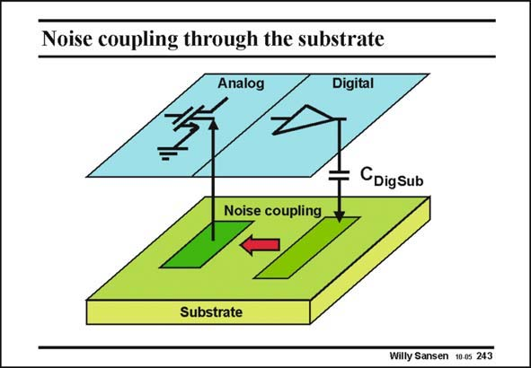

# SANSEN-243 · Noise coupling through the substrate

章节：24 数模混合集成电路中的耦合效应  
PDF 页：732；书本页：744；幻灯片编号：243  
状态：unreviewed



## 对应教材讲解

### PDF 731 · 书本 743

In coupling, three phenomena have to be investigated. The first one is the generator of the noise. The digital circuits usually work with a clock. They draw current spikes through their supply lines, which cause voltage spikes on the supply linesand ground.

### PDF 732 · 书本 744

These spikes are then injected into the substrate, as each output has a small capacitance C to the DigSub substrate. They have a wide frequency spectrum. This is why they are called noise. The second phenomenon is the transmission of this noise to the other side of the substrate, where the analog circuits are present. This obviously depends on the nature of the substrate, on the presence of an epitaxial layer, etc. The third phenomenon is the pickup of this noise by the sensitive analog circuits. Each transistor also has the substrate as an input. It converts the substrate noise into a drain current. As a result, the SNR suffers badly from substrate noise. The most important specification with this respect, is the PSSR or Power-supply-rejection ratio. All analog circuits are better made fully-differential to reject the substrate noise as much as possible. Mismatch limits this rejection however, and limits the SNR, which can be reached in a mixed-signal circuit.

## 公式／性能结论候选摘录

以下为规则截取的原文，尚未逐项判读。

- PDF 732: This obviously depends on the nature of the substrate, on the presence of an epitaxial layer, etc.
- PDF 732: As a result, the SNR suffers badly from substrate noise.
- PDF 732: Mismatch limits this rejection however, and limits the SNR, which can be reached in a mixed-signal circuit.

## 曲线结论候选摘录

以下为规则截取的原文，尚未逐项判读。

（未由规则找到；不代表原页没有此类内容。）

## 原文条件与近似候选摘录

以下为规则截取的原文，尚未逐项判读。

（未由规则找到；不代表原页没有此类内容。）

## 幻灯片 OCR（未校正）

```text
Noise coupling through the substrate
Analog
Digital
CDigsub
Noise coupling
Substrate
Willy Sansen 10.0s 243
```

数学上下标、分数及正负号以原图为准。电路图已保留；未核对的连接不输出成可仿真 netlist。
