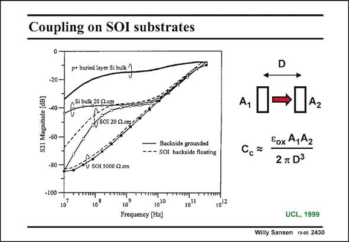

# SANSEN-2430 · Coupling on SOl substrates

章节：24 数模混合集成电路中的耦合效应  
PDF 页：746；书本页：758；幻灯片编号：2430  
状态：unreviewed



## 对应教材讲解

### PDF 746 · 书本 758

Horizontal coupling between two parallel lines is purely capacitive. However, this is only true for non-conductive substrates. The coupling is shown between two parallel conductors at some distance, such that the isolation is about 60 dB at 1 GHz. It is purely capacitive. It evidently decreases at 20 dB/ decade. This is only true for perfectly isolating SOI substrates. Actually, this capacitance can be calculated, as shown in this slide for two areas A, a distance apart D, which is much larger than the dimension of area A. It is assumed that the dielectric is pure silicon oxide. These curves also show that the isolation becomes more resistive the higher the doping level is. For partially doped SOI (around 20 Vcm), the coupling is resistive between 200 MHz and 10 GHz. The same applies to bulk silicon with the same low resistivity (20 Vcm). Taking SOI does not pay off in this frequency region! Bulk silicon is a lot worse. For frequencies higher than 100 MHz, it provides very little isolation. The coupling is resistive. It can be modeled with resistors as done before. At very low frequencies, the isolation can be very large. It is now mainly limited by the leakage currents of the reverse biased diodes (Drain-bulk, etc. ...).

## 公式／性能结论候选摘录

以下为规则截取的原文，尚未逐项判读。

- PDF 746: It evidently decreases at 20 dB/ decade.
- PDF 746: It is now mainly limited by the leakage currents of the reverse biased diodes (Drain-bulk, etc. ...).

## 曲线结论候选摘录

以下为规则截取的原文，尚未逐项判读。

- PDF 746: These curves also show that the isolation becomes more resistive the higher the doping level is.

## 原文条件与近似候选摘录

以下为规则截取的原文，尚未逐项判读。

- PDF 746: Actually, this capacitance can be calculated, as shown in this slide for two areas A, a distance apart D, which is much larger than the dimension of area A.
- PDF 746: It is assumed that the dielectric is pure silicon oxide.

## 幻灯片 OCR（未校正）

```text
Coupling on SOl substrates
p+ buried layer Si bulk
-20 -
S21 Magnitude (dB)
Si bulik 20 R.cga
SO1 200.cm,
Backside grounded
- - - SOi backside floating
-80
V SO1 5000 0.em
-100
10'
10
1010
10"
1012
Frequency [H2]
D
A,
2
Eox A,A2
2 T D'
UCL, 1999
Willy Sansen 10-05 2430
```

数学上下标、分数及正负号以原图为准。电路图已保留；未核对的连接不输出成可仿真 netlist。
