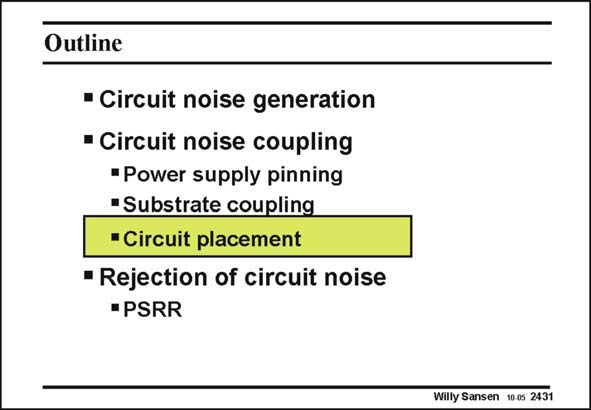

# SANSEN-2431 · Slide 2431

章节：24 数模混合集成电路中的耦合效应  
PDF 页：746；书本页：758；幻灯片编号：2431  
状态：unreviewed



## 对应教材讲解

### PDF 746 · 书本 758

Now that we know what isolation to expect in the substrate, let us see how transmission in the substrate can be modeled and what layout rules can be extracted. This is mainly based on simulations of larger substrates with noise sources and sensitive preamplifiers combined. Sometimes experimental data is available as well, however.

## 公式／性能结论候选摘录

以下为规则截取的原文，尚未逐项判读。

（未由规则找到；不代表原页没有此类内容。）

## 曲线结论候选摘录

以下为规则截取的原文，尚未逐项判读。

（未由规则找到；不代表原页没有此类内容。）

## 原文条件与近似候选摘录

以下为规则截取的原文，尚未逐项判读。

（未由规则找到；不代表原页没有此类内容。）

## 幻灯片 OCR（未校正）

```text
Outline
• Circuit noise generation
• Circuit noise coupling
•Power supply pinning
"Substrate coupling
• Circuit placement
• Rejection of circuit noise
- PSRR
Willy Sansen 10.05 2431
```

数学上下标、分数及正负号以原图为准。电路图已保留；未核对的连接不输出成可仿真 netlist。
