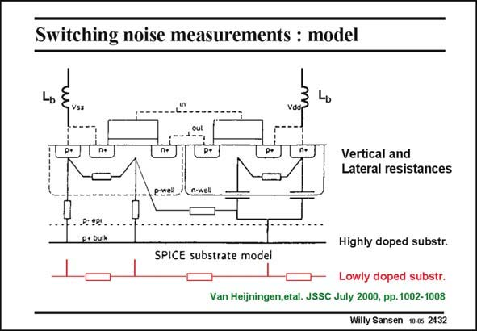

# SANSEN-2432 · Switching noise measurements : model

章节：24 数模混合集成电路中的耦合效应  
PDF 页：747；书本页：759；幻灯片编号：2432  
状态：unreviewed



## 对应教材讲解

### PDF 747 · 书本 759

Experimental work to model all substrate resistances and capacitances is a tedious job. It is the only way however, to obtain realistic results with simulations. In this way, the effect of bond wire inductances can be evaluated. An example is given in this slide. A cross-section is given of a CMOS inverter in n-well CMOS. Actually, this is twin-well CMOS as an additional p-well is provided in the p-substrate for the nMOSTs. Both cases are considered, i.e. a highly doped substrate which can be regarded as a equipotential plane, and a lowly-doped substrate, which has to be modeled by horizontal resistors or impedances. The nMOST in the p-well has a p+ substrate contact, connected with the Source to ground over a bonding wire L . There is a horizontal resistor (or impedance) between the channel area b of the nMOST and its substrate contact. There are also two resistors (or impedances) connecting the channel area and the contact area to the substrate. Similarly, for the pMOST, a horizontal resistor (or impedance) must be included between the channel area and the substrate contact. Moreover, two separate capacitors are required to model the depletion region of the n-well on the p-substrate. One additional horizontal resistor (or impedance) is required to model the area between both transistors. All these resistors (or impedances) are distributed resistors and are therefore not easy to model.

## 公式／性能结论候选摘录

以下为规则截取的原文，尚未逐项判读。

- PDF 747: All these resistors (or impedances) are distributed resistors and are therefore not easy to model.

## 曲线结论候选摘录

以下为规则截取的原文，尚未逐项判读。

（未由规则找到；不代表原页没有此类内容。）

## 原文条件与近似候选摘录

以下为规则截取的原文，尚未逐项判读。

- PDF 747: Actually, this is twin-well CMOS as an additional p-well is provided in the p-substrate for the nMOSTs.

## 幻灯片 OCR（未校正）

```text
Switching noise measurements : model
Vertical and
Lateral resistances
.P: gpy
p+ bulk
Highly doped substr.
SPICE substrate model
Lowly doped substr.
Van Heijningen,etal. JSSC July 2000, pp.1002-1008
Willy Sansen 10 0s 2432
```

数学上下标、分数及正负号以原图为准。电路图已保留；未核对的连接不输出成可仿真 netlist。
