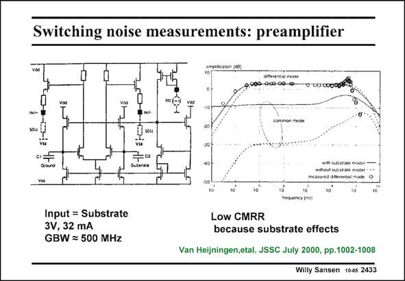

# SANSEN-2433 · Switching noise measurements: preamplifier

章节：24 数模混合集成电路中的耦合效应  
PDF 页：747；书本页：759；幻灯片编号：2433  
状态：unreviewed



## 对应教材讲解

### PDF 747 · 书本 759

In order to measure the substrate noise, a wide-band amplifier is required, as shown in this slide. It is a single differential pair with output Source followers. The CMRR is somewhat limited by uneven substrate impedances. However, it does provide a GBW of 500 MHz. The difference is measured between the external ground and the substrate. Both are capacitively coupled. The output voltage

### PDF 748 · 书本 760

includes all noise picked up from the substrate after redistribution by all horizontal and vertical impedances, as discussed previously.

## 公式／性能结论候选摘录

以下为规则截取的原文，尚未逐项判读。

- PDF 747: The CMRR is somewhat limited by uneven substrate impedances.

## 曲线结论候选摘录

以下为规则截取的原文，尚未逐项判读。

（未由规则找到；不代表原页没有此类内容。）

## 原文条件与近似候选摘录

以下为规则截取的原文，尚未逐项判读。

（未由规则找到；不代表原页没有此类内容。）

## 幻灯片 OCR（未校正）

```text
Switching noise measurements: preamplifier
009-060-00-9
T uu 0o0t
sou
s0m
vu
Sscarata
wihout suostale model-
Input = Substrate
3V, 32 mA
GBW = 500 MHz
Low CMRR
because substrate effects
Van Heijningen,etal. JSSC July 2000, pp.1002-1008
Willy Sansen 10-05 2433
```

数学上下标、分数及正负号以原图为准。电路图已保留；未核对的连接不输出成可仿真 netlist。
