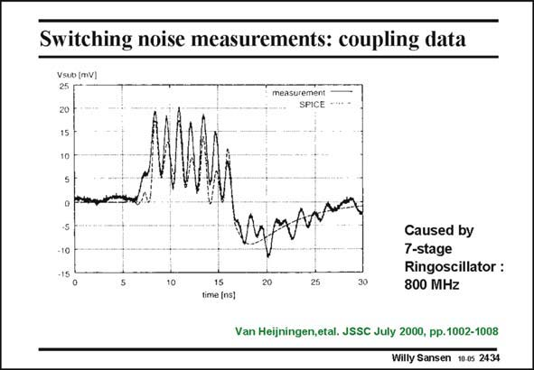

# SANSEN-2434 · Switching noise measurements: coupling data

章节：24 数模混合集成电路中的耦合效应  
PDF 页：748；书本页：760；幻灯片编号：2434  
状态：unreviewed



## 对应教材讲解

### PDF 748 · 书本 760

The output voltage is shown in this slide. The noise is generated by a ring oscillator, which can be switched on and off. Its frequency is about 800 MHz. It is clear that this frequency is clearly visible at the substrate of the analog MOSTs. It can now be regarded as an input signal at the back gate of the MOSTs. Moreover, it also shows that the horizontal and vertical resistors (or impedances) can be modeled fairly well. The measurement results do not deviate a significant amount from the SPICE results. In conclusion, the modeling of the distributed horizontal and vertical impedances is a necessity to be able to predict coupling by means of simulation.

## 公式／性能结论候选摘录

以下为规则截取的原文，尚未逐项判读。

- PDF 748: In conclusion, the modeling of the distributed horizontal and vertical impedances is a necessity to be able to predict coupling by means of simulation.

## 曲线结论候选摘录

以下为规则截取的原文，尚未逐项判读。

（未由规则找到；不代表原页没有此类内容。）

## 原文条件与近似候选摘录

以下为规则截取的原文，尚未逐项判读。

（未由规则找到；不代表原页没有此类内容。）

## 幻灯片 OCR（未校正）

```text
Switching noise measurements: coupling data
Vsuo [mV]|
25
20
15
measurement
SPICE
-10
-15
15
time (ns]
20|
Caused by
7-stage
Ringoscillator :
800 MHz
Van Heijningen,etal. JSSC July 2000, pp.1002-1008
Willy Sansen 10.05 2434
```

数学上下标、分数及正负号以原图为准。电路图已保留；未核对的连接不输出成可仿真 netlist。
