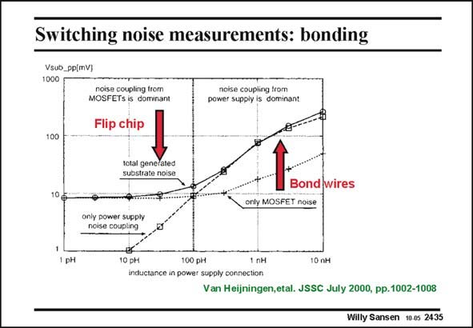

# SANSEN-2435 · Switching noise measurements: bonding

章节：24 数模混合集成电路中的耦合效应  
PDF 页：748；书本页：760；幻灯片编号：2435  
状态：unreviewed



## 对应教材讲解

### PDF 748 · 书本 760

From the same data, the influence of the bonding wires can be extracted in great detail. The noise is generated in the substrate and reaches the analog CMOS inverter through substrate coupling. If bonding wires are used with large inductances, then the noise currents cannot escape from the substrate contacts. As a consequence, the noise levels in the substrate underneath the analog circuits are high. This is illustrated in this slide. It shows the voltage obtained on the substrate, versus bond wire inductance. Very low inductance can only be obtained with flip-chip bonding. In this case the supply line and ground contacts carry zero resistance. What is left is due to direct coupling to the Sources and Drains of the MOSTs.

### PDF 749 · 书本 761

The cross-over point seems to be around 0.1 nH which corresponds to about 0.1 mm bonding wire. This is very short indeed, and not practical.

## 公式／性能结论候选摘录

以下为规则截取的原文，尚未逐项判读。

（未由规则找到；不代表原页没有此类内容。）

## 曲线结论候选摘录

以下为规则截取的原文，尚未逐项判读。

（未由规则找到；不代表原页没有此类内容。）

## 原文条件与近似候选摘录

以下为规则截取的原文，尚未逐项判读。

（未由规则找到；不代表原页没有此类内容。）

## 幻灯片 OCR（未校正）

```text
Switching noise measurements: bonding
Vsub_pp[mV)
1000
noise coupling from
MOSFETs is dominant
Flip chip
noise coupling trom
power supply is dominant
100
total genefated
substrate noise
Bond wires
onty MOSFET noise
only power supply
noise coupling
1pH
10 ph
100 pн
1 nH
inductance in power supply connection
Van Heijningen,etal. JSSC July 2000, pp.1002-1008
Willy Sansen 10.05 2435
```

数学上下标、分数及正负号以原图为准。电路图已保留；未核对的连接不输出成可仿真 netlist。
