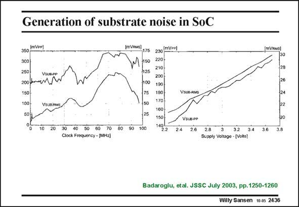

# SANSEN-2436 · Generation of substrate noise in SoC

章节：24 数模混合集成电路中的耦合效应  
PDF 页：749；书本页：761；幻灯片编号：2436  
状态：unreviewed



## 对应教材讲解

### PDF 749 · 书本 761

In the previous example, a 7-stage ring oscillator is used as a noise source and only a single-CMOS inverter-amplifier as receiver. This has been extended to a 220-Kgates telecom chip as a noise source and a WLAN modem as receiver. The bonding wires are 6 nH. Both the peak-to-peak and the RMS noise are shown (on the left). The largest peak around 75 MHz can also be found by simulation. Accurate values have been introduced for all parasitic resistances and capacitances. There is a fairly linear relation between the noise and the supply voltage. This is a result of the increased current injection in the substrate, which increases linearly with the supply voltage. It is also found that as a great deal of noise is generated by the Input/Output buffers as by the digital gates themselves!

## 公式／性能结论候选摘录

以下为规则截取的原文，尚未逐项判读。

- PDF 749: This is a result of the increased current injection in the substrate, which increases linearly with the supply voltage.

## 曲线结论候选摘录

以下为规则截取的原文，尚未逐项判读。

- PDF 749: Both the peak-to-peak and the RMS noise are shown (on the left).
- PDF 749: The largest peak around 75 MHz can also be found by simulation.

## 原文条件与近似候选摘录

以下为规则截取的原文，尚未逐项判读。

（未由规则找到；不代表原页没有此类内容。）

## 幻灯片 OCR（未校正）

```text
Generation of substrate noise in SoC
(mVPp)
350
300
250
200 kn2w
150
100 -
VsuB.RMS
175
150|
425
100
50
230 (mVPP)
220 -
210-
200
190
180
170
160
150
10
20
30 40 50
80
70
Clock Frequency - [MH2]|
32
Supply Voltage - (Volts)
Badaroglu, etal. JSSC July 2003, pp.1250-1260
Willy Sansen 10 0s 2436
```

数学上下标、分数及正负号以原图为准。电路图已保留；未核对的连接不输出成可仿真 netlist。
