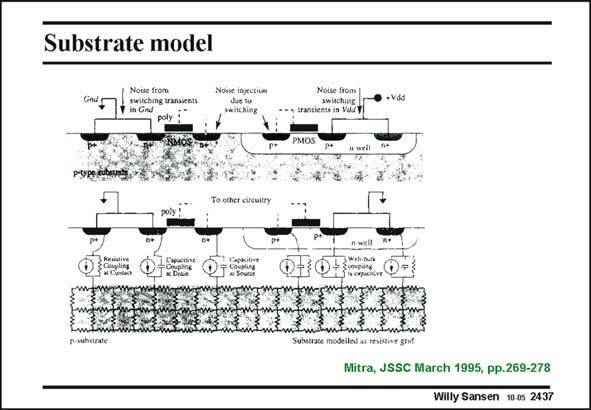

# SANSEN-2437 · Substrate model

章节：24 数模混合集成电路中的耦合效应  
PDF 页：749；书本页：761；幻灯片编号：2437  
状态：unreviewed



## 对应教材讲解

### PDF 749 · 书本 761

Another example of a substrate model to carry out simulations of the noise coupling in more complex circuitry is shown in this slide. A digital CMOS inverter is shown together with its substrate contacts. It causes the injection of a number of currents into the substrate. The substrate itself is modeled as a mesh of resistors. The noise currents have various origins, such as noise from the switching transients on the supply lines and noise from the switching on the output Drains. These noise currents are modeled as separate independent input current sources, in parallel with either resistors (if no junctions are involved) or capacitors (in the case of junctions).

### PDF 750 · 书本 762

Long simulations are required to discover which are the nodes in the circuit with higher noise coupling and with lower noise coupling. Examples of the results are shown next.

## 公式／性能结论候选摘录

以下为规则截取的原文，尚未逐项判读。

- PDF 749: These noise currents are modeled as separate independent input current sources, in parallel with either resistors (if no junctions are involved) or capacitors (in the case of junctions).

## 曲线结论候选摘录

以下为规则截取的原文，尚未逐项判读。

（未由规则找到；不代表原页没有此类内容。）

## 原文条件与近似候选摘录

以下为规则截取的原文，尚未逐项判读。

（未由规则找到；不代表原页没有此类内容。）

## 幻灯片 OCR（未校正）

```text
Substrate model
Noise from
Ginds
p-type eot
1Q..0
Xuled as tesitie etu.
Mitra, JSSC March 1995, pp.269-278
Willy Sansen 10 0s 2437
```

数学上下标、分数及正负号以原图为准。电路图已保留；未核对的连接不输出成可仿真 netlist。
