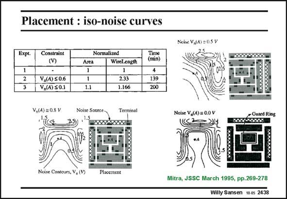

# SANSEN-2438 · Placement : iso-noise curves

章节：24 数模混合集成电路中的耦合效应  
PDF 页：750；书本页：762；幻灯片编号：2438  
状态：unreviewed



## 对应教材讲解

### PDF 750 · 书本 762

It is obvious that the simulation times heavily depend on the resolution of the mesh. The simulation time increases with a higher order of the number of nodes. Only partial circuits can therefore be handled, depending on the computer used. Examples are given of isonoise curves (or contours) obtained for an amplifier surrounded by three noise sources (bottom left). Clearly, these noise sources cause a great deal of noise, even in the middle where the amplifier is positioned (point A). When a guard ring is added however (bottom right), the noise contours are compressed closer to the noise sources, leaving the center (point A) nearly noiseless. If, on the other hand, all noise sources are on top and on the right (top right) the noise contours are clearly asymmetrical. Such simulations show that it is possible to obtain quantitative data about noise coupling. However, depending on the computer power available, such simulations will always be limited to partial circuits.

## 公式／性能结论候选摘录

以下为规则截取的原文，尚未逐项判读。

- PDF 750: It is obvious that the simulation times heavily depend on the resolution of the mesh.
- PDF 750: The simulation time increases with a higher order of the number of nodes.
- PDF 750: Only partial circuits can therefore be handled, depending on the computer used.
- PDF 750: However, depending on the computer power available, such simulations will always be limited to partial circuits.

## 曲线结论候选摘录

以下为规则截取的原文，尚未逐项判读。

- PDF 750: Examples are given of isonoise curves (or contours) obtained for an amplifier surrounded by three noise sources (bottom left).

## 原文条件与近似候选摘录

以下为规则截取的原文，尚未逐项判读。

（未由规则找到；不代表原页没有此类内容。）

## 幻灯片 OCR（未校正）

```text
Placement : iso-noise curves
Ncise V,(A) = 0S V
Expt.
Constraint
(V)
V,(A) $0.6
V,(A) S0.1
Arca
1.1
Normalized
Wirel ength
2.33
1.166
Time
(min)
139
200
V,(A) = 0.8 V
Noise Source
Terminal
Noise V,(A) = 0.0 V
Guard Ring
Noise Contours, V, (V)
Placement
Mitra, JSSC March 1995, pp.269-278
Willy Sansen 10 0s 2438
```

数学上下标、分数及正负号以原图为准。电路图已保留；未核对的连接不输出成可仿真 netlist。
