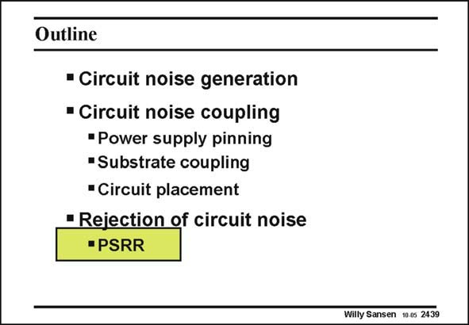

# SANSEN-2439 · Slide 2439

章节：24 数模混合集成电路中的耦合效应  
PDF 页：750；书本页：762；幻灯片编号：2439  
状态：unreviewed



## 对应教材讲解

### PDF 750 · 书本 762

If everything fails, if a lot of noise is generated by the digital or class-AB circuits and if the substrates under digital and analog are not isolated at all, then we can still try to make the analog circuits insensitive to the substrate and power supply noise. This specification is called the power-supply rejection ratio (PSRR). We will see that the PSRR is never as good for single-ended amplifiers. The conclusion is

### PDF 751 · 书本 763

that all mixed-signal circuits must be made full-differential. As a result, the power consumption increases drastically (more than doubles!). For full-differential circuitry, the limit is now reached by mismatch. This is also the case for CMRR. Actually, what the PSRR is for the rejection of power-supply-line noise is the CMRR for the rejection of ground noise. Its definition is therefore easily established.

## 公式／性能结论候选摘录

以下为规则截取的原文，尚未逐项判读。

- PDF 750: The conclusion is
- PDF 751: As a result, the power consumption increases drastically (more than doubles!).
- PDF 751: For full-differential circuitry, the limit is now reached by mismatch.
- PDF 751: Its definition is therefore easily established.

## 曲线结论候选摘录

以下为规则截取的原文，尚未逐项判读。

（未由规则找到；不代表原页没有此类内容。）

## 原文条件与近似候选摘录

以下为规则截取的原文，尚未逐项判读。

（未由规则找到；不代表原页没有此类内容。）

## 幻灯片 OCR（未校正）

```text
Outline
• Circuit noise generation
• Circuit noise coupling
•Power supply pinning
"Substrate coupling
• Circuit placement
• Rejection of circuit noise
•PSRR
Willy Sansen 10 05 2439
```

数学上下标、分数及正负号以原图为准。电路图已保留；未核对的连接不输出成可仿真 netlist。
