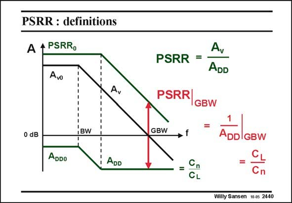

# SANSEN-2440 · PSRR : definitions

章节：24 数模混合集成电路中的耦合效应  
PDF 页：751；书本页：763；幻灯片编号：2440  
状态：unreviewed



## 对应教材讲解

### PDF 751 · 书本 763

This Bode diagram shows the gain A of an amplifier v for a differential input. It is high at low frequencies (A ) v0 but decreases with a slope of −20 dB/decade until the GBW is reached. The gain A of this DD amplifier is also shown with the positive power supply v as an input. It is rather DD low at low frequencies (A ) but does not change DD0 all that much at high frequencies. The reason is that at high frequencies, capacitive coupling prevents the output voltage to become really small. The output becomes constant as a result of a ratio of some capacitors, usually the load capacitor C and some parasitic L coupling capacitor C . If C is 2 pF and C is 0.1 pF, the ratio is now 20 or 26 dB. n L n The PSRR is now defined as the ratio of the gain A to the differential input to the gain A v DD of the supply voltage. It is high at low frequencies and low at high frequencies. At the GBW however, the gain A is unity. At this frequency, the PSRR equals the inverse of the gain A . v DD It is an excellent measure of the PSRR at high frequencies. For the example in this slide, the PSRR is 26 dB at the GBW. At this frequency, the PSRR is rather small, because it is a ratio of two capacitors, the load capacitor and some parasitic coupling capacitor.

## 公式／性能结论候选摘录

以下为规则截取的原文，尚未逐项判读。

- PDF 751: This Bode diagram shows the gain A of an amplifier v for a differential input.
- PDF 751: It is high at low frequencies (A ) v0 but decreases with a slope of −20 dB/decade until the GBW is reached.
- PDF 751: The gain A of this DD amplifier is also shown with the positive power supply v as an input.
- PDF 751: The output becomes constant as a result of a ratio of some capacitors, usually the load capacitor C and some parasitic L coupling capacitor C .
- PDF 751: If C is 2 pF and C is 0.1 pF, the ratio is now 20 or 26 dB. n L n The PSRR is now defined as the ratio of the gain A to the differential input to the gain A v DD of the supply voltage.
- PDF 751: At the GBW however, the gain A is unity.
- PDF 751: At this frequency, the PSRR equals the inverse of the gain A . v DD It is an excellent measure of the PSRR at high frequencies.

## 曲线结论候选摘录

以下为规则截取的原文，尚未逐项判读。

- PDF 751: This Bode diagram shows the gain A of an amplifier v for a differential input.
- PDF 751: It is high at low frequencies (A ) v0 but decreases with a slope of −20 dB/decade until the GBW is reached.

## 原文条件与近似候选摘录

以下为规则截取的原文，尚未逐项判读。

（未由规则找到；不代表原页没有此类内容。）

## 幻灯片 OCR（未校正）

```text
PSRR : definitions
A
4 PSRRo
Avo
Av
BW
0 dB
ADDo
ADD
PSRR =
A,
ADD
PSRR
IGBW
GBW
CL
ADDIGBW
CL
Cn
Willy Sansen 10 0s 2440
```

数学上下标、分数及正负号以原图为准。电路图已保留；未核对的连接不输出成可仿真 netlist。
