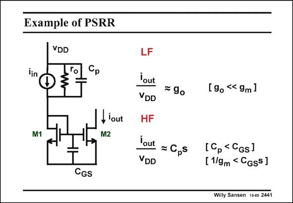

# SANSEN-2441 · Example of PSRR

章节：24 数模混合集成电路中的耦合效应  
PDF 页：752；书本页：764；幻灯片编号：2441  
状态：unreviewed



## 对应教材讲解

### PDF 751 · 书本 763

What components play an important role in PSRR? An example is given in this slide of a current amplifier. The impedance at the Gates of transistors M1 and M2 is low. Does this mean that the PSRR is large at high frequencies? At low frequencies, all capacitances can be left out. In this case, output resistor r determines o the current to the current mirror. The output current is therefore small. At high frequencies, the parasitic coupling capacitance C takes over the role of r . The current p o to the current mirror now increases with frequency and so does the output current. The gain of

### PDF 752 · 书本 764

the current mirror is constant up to a frequency g /2pC or f . This is evim GS T dently higher than all frequencies of interest. Note that capacitance C p is a coupling capacitor between the positive supply line and the output of the input transistor. It is usually a lot larger than the output capacitor of the transistor only.

## 公式／性能结论候选摘录

以下为规则截取的原文，尚未逐项判读。

- PDF 751: The output current is therefore small.
- PDF 751: The current p o to the current mirror now increases with frequency and so does the output current.
- PDF 751: The gain of

## 曲线结论候选摘录

以下为规则截取的原文，尚未逐项判读。

（未由规则找到；不代表原页没有此类内容。）

## 原文条件与近似候选摘录

以下为规则截取的原文，尚未逐项判读。

（未由规则找到；不代表原页没有此类内容。）

## 幻灯片 OCR（未校正）

```text
Example of PSRR
VDD
lin
M1
fiout
M2
CGS
LF
Yout
VDD
= 90
lout = Cps
VDD
[9o < 9m]
[Cp < CGs]
[ 1/9m < CGss]
Willy Sansen 1005 2441
```

数学上下标、分数及正负号以原图为准。电路图已保留；未核对的连接不输出成可仿真 netlist。
