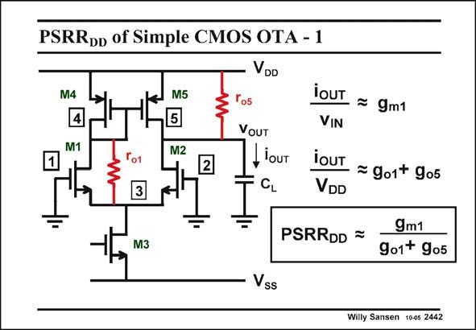

# SANSEN-2442 · PSRRpD of Simple CMOS OTA - 1

章节：24 数模混合集成电路中的耦合效应  
PDF 页：752；书本页：764；幻灯片编号：2442  
状态：unreviewed



## 对应教材讲解

### PDF 752 · 书本 764

Let us now have a look at the PSRR of a simple DD OTA, as shown in this slide. A detailed analysis has shown that the most important components are r and o1 r . Indeed, the current o5 caused by a small signal on the positive supply voltage v flows through M4, DD through resistor r and o1 through M2 to the output. The current through r o5 reaches the output directly. The PSRR of this gain DD block is now the ratio of both gains given in this slide. It has a very similar expression as the small-signal voltage gain. It is also large at low frequencies as it includes the g r products of the transistors in the m o signal path. It will be reduced at higher frequencies.

## 公式／性能结论候选摘录

以下为规则截取的原文，尚未逐项判读。

- PDF 752: The PSRR of this gain DD block is now the ratio of both gains given in this slide.
- PDF 752: It has a very similar expression as the small-signal voltage gain.

## 曲线结论候选摘录

以下为规则截取的原文，尚未逐项判读。

（未由规则找到；不代表原页没有此类内容。）

## 原文条件与近似候选摘录

以下为规则截取的原文，尚未逐项判读。

（未由规则找到；不代表原页没有此类内容。）

## 幻灯片 OCR（未校正）

```text
PSRRpD of Simple CMOS OTA - 1
VDD
M4
4
M1
M5
5
M2
2
3
VOUT
, louT
CL
M3
iOUT = gm1
VIN
ioUT
— = 901+ gо5
VDD
PSRRDD =
9m1
9o1+ gos
Vss
Willy Sansen 10-05 2442
```

数学上下标、分数及正负号以原图为准。电路图已保留；未核对的连接不输出成可仿真 netlist。
