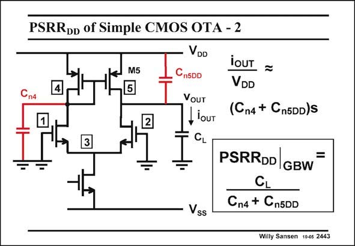

# SANSEN-2443 · PSRRpD of Simple CMOS OTA - 2

章节：24 数模混合集成电路中的耦合效应  
PDF 页：753；书本页：765；幻灯片编号：2443  
状态：unreviewed



## 对应教材讲解

### PDF 752 · 书本 764

The PSRR at higher frequency is of much higher importance as digital blocks on chips are DD more likely going to work at high clock frequencies. These are the frequencies which are expected to be rejected by the analog circuits. At high frequencies, the coupling is mainly carried out by the capacitors C and C . The n4 n5DD first one C is a capacitance from node 4 to ground. Capacitor C is the coupling capacitance n4 n5DD between node 5 (at the output) and the V supply line. Again, this capacitance can be a great DD

### PDF 753 · 书本 765

deal larger than the output capacitor C of transistor DS M5. It is made up by the coupling between the V DD supply line and the output line of the amplifier. For the PSRR at high DD frequencies the g comes in m1 of the input devices. At the GBW however, the g is m1 substituted by C , as shown L in this slide. As expected, this PSRR DD at the GBW is not very large, as it is a ratio of small capacitances. For a frequency at 1/10th of the GBW, the PSRR is 20 dB larger, etc. DD Note that the PSRR can only be high if both the capacitances C and C are small. DD n4 n5DD

## 公式／性能结论候选摘录

以下为规则截取的原文，尚未逐项判读。

（未由规则找到；不代表原页没有此类内容。）

## 曲线结论候选摘录

以下为规则截取的原文，尚未逐项判读。

（未由规则找到；不代表原页没有此类内容。）

## 原文条件与近似候选摘录

以下为规则截取的原文，尚未逐项判读。

（未由规则找到；不代表原页没有此类内容。）

## 幻灯片 OCR（未校正）

```text
PSRRpD of Simple CMOS OTA - 2
VDD
CnSDD
Сп4
M5
5
2
VoUT
, louT
ioUT =
VDD
(Cn4 + Cn5DD)S
Vss
PSRRDD GBW
=
CL
Cn4 + Cn5DD
Willy Sansen 1005 2443
```

数学上下标、分数及正负号以原图为准。电路图已保留；未核对的连接不输出成可仿真 netlist。
