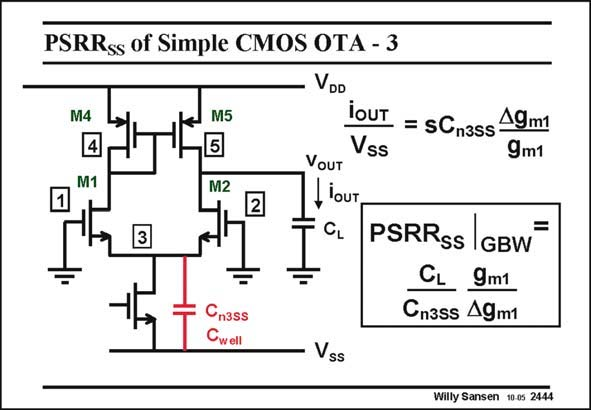

# SANSEN-2444 · PSRRss of Simple CMOS OTA - 3

章节：24 数模混合集成电路中的耦合效应  
PDF 页：753；书本页：765；幻灯片编号：2444  
状态：unreviewed



## 对应教材讲解

### PDF 753 · 书本 765

The PSRR with respect to SS the other supply voltage is significantly different. It is caused by the coupling capacitor C at the n3DD common-Source point. For perfect matching of the transistor pair M1,2 and M4,5 none of this current can flow through the output load C . L Mismatch between, for example, transistors M1 and M2, will cause some of this current to flow through the output load, however. The PSRR will be a SS ratio of capacitors, multiplied by a matching factor. It will be a lot larger than the PSRR of DD the positive supply line. On the other hand, this coupling capacitance can be quite large as the capacitance C well between the p-well and the substrate has to be added. Both input devices are in this p-well. Its area is therefore quite large and so is the capacitor C . well Note that nowadays mainly n-well CMOS technologies are used. The structure is then inverted – the input devices are then pMOSTs.

## 公式／性能结论候选摘录

以下为规则截取的原文，尚未逐项判读。

- PDF 753: Its area is therefore quite large and so is the capacitor C . well Note that nowadays mainly n-well CMOS technologies are used.

## 曲线结论候选摘录

以下为规则截取的原文，尚未逐项判读。

（未由规则找到；不代表原页没有此类内容。）

## 原文条件与近似候选摘录

以下为规则截取的原文，尚未逐项判读。

（未由规则找到；不代表原页没有此类内容。）

## 幻灯片 OCR（未校正）

```text
PSRRss of Simple CMOS OTA - 3
VDo
M4
4
M1
M5
5
M2
iOUT = sCn3ss 19m1
Vss
VOUT
2
Liour,
CL
PSRRss |GBW
CL 9m1
Cnass 49m1
Cn3ss
Cwell
Vss
Willy Sansen 10-05 2444
```

数学上下标、分数及正负号以原图为准。电路图已保留；未核对的连接不输出成可仿真 netlist。
