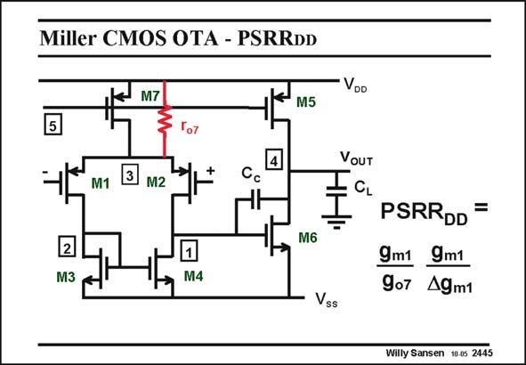

# SANSEN-2445 · Miller CMOS OTA - PSRRDD

章节：24 数模混合集成电路中的耦合效应  
PDF 页：754；书本页：766；幻灯片编号：2445  
状态：unreviewed



## 对应教材讲解

### PDF 754 · 书本 766

The situation is somewhat more complicated in a twostage Miller OTA. After all, when the input signal is applied at the positive supply voltage, it is not clear whether the current through the first stage is added or subtracted from the current through the second stage. A thorough calculation at low frequencies shows that the current through output resistor r of the o7 current source transistor M7 of the first stage is the dominant one. This current can only provide a contribution to the output voltage of the first stage provided there is some mismatch in the first stage, as previously explained. At low frequencies, the PSRR is then readily found. It can be fairly large as it contains DD two factors.

## 公式／性能结论候选摘录

以下为规则截取的原文，尚未逐项判读。

（未由规则找到；不代表原页没有此类内容。）

## 曲线结论候选摘录

以下为规则截取的原文，尚未逐项判读。

（未由规则找到；不代表原页没有此类内容。）

## 原文条件与近似候选摘录

以下为规则截取的原文，尚未逐项判读。

- PDF 754: This current can only provide a contribution to the output voltage of the first stage provided there is some mismatch in the first stage, as previously explained.

## 幻灯片 OCR（未校正）

```text
Miller CMOS OTA - PSRRDD
M7
M5
VDD
5
VOUT
M1
3
M2
Cc
I
2
M3
M6
M4
PSRRDD =
9m1 9m1
907 49m1
Vss
Willy Sansen 10-0s 2445
```

数学上下标、分数及正负号以原图为准。电路图已保留；未核对的连接不输出成可仿真 netlist。
