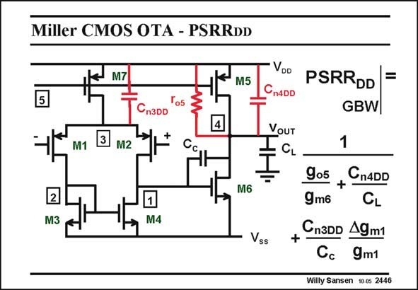

# SANSEN-2446 · Miller CMOS OTA - PSRRDD

章节：24 数模混合集成电路中的耦合效应  
PDF 页：754；书本页：766；幻灯片编号：2446  
状态：unreviewed



## 对应教材讲解

### PDF 754 · 书本 766

At high frequencies, the situation is very different. First of all, capacitances take over but also resistor r remains in the expreso5 sions. Calculations show that the PSRR at the DD GBW now contains three terms. Two of them are simply related to the two dominant coupling capacitors. For the first C it is easy to see n3DD that this performs exactly the same role as resistor r . o7 The mismatch in the first stage comes in. Also, C can be quite large as it includes the well to substrate capacitance of n3DD the input transistors. Capacitor C is the direct coupling capacitance between the supply line and the output. n4DD The first term g /g is somewhat harder to understand. It is actually the resistive divider o5 m6 from the supply line to the output, made up by r and the resistance 1/g offered by M6 at o5 m6 high frequencies.

### PDF 755 · 书本 767

It is impossible to predict which one of the three terms is dominant. It is probably the first or the second one as they only have one single factor involved. The last one has two factors.

## 公式／性能结论候选摘录

以下为规则截取的原文，尚未逐项判读。

（未由规则找到；不代表原页没有此类内容。）

## 曲线结论候选摘录

以下为规则截取的原文，尚未逐项判读。

（未由规则找到；不代表原页没有此类内容。）

## 原文条件与近似候选摘录

以下为规则截取的原文，尚未逐项判读。

（未由规则找到；不代表原页没有此类内容。）

## 幻灯片 OCR（未校正）

```text
Miller CMOS OTA - PSRRDD
M7
M5
To5
Cn3DD
3
4
M1
M2
VOD
CnADD
VOUT
CL
PSRRDD =
GBW
1
2
M3
M6
M4
Vss
905
Cn4DD
9m6
CL
+
Cn3DD 4gm1
9m1
Willy Sansen 10 0s 2446
```

数学上下标、分数及正负号以原图为准。电路图已保留；未核对的连接不输出成可仿真 netlist。
