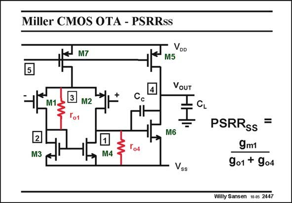

# SANSEN-2447 · Miller CMOS OTA - PSRRss

章节：24 数模混合集成电路中的耦合效应  
PDF 页：755；书本页：767；幻灯片编号：2447  
状态：unreviewed



## 对应教材讲解

### PDF 755 · 书本 767

The PSRR from the nega- SS tive supply does not involve matching. Indeed at low frequencies, it is a result of currents through resistors r o1 and r . o4 The current through resistor r flows through M3 o1 (and the input devices M1 and M2). It is therefore mirrored to M4 and injected as a current on node 1. From here it is amplified to the output in the same way as the signal current from the input transistors M1 and M2. The current through r is also injected as a current on node 1. It is now added to the o4 previous current.

## 公式／性能结论候选摘录

以下为规则截取的原文，尚未逐项判读。

- PDF 755: It is therefore mirrored to M4 and injected as a current on node 1.

## 曲线结论候选摘录

以下为规则截取的原文，尚未逐项判读。

（未由规则找到；不代表原页没有此类内容。）

## 原文条件与近似候选摘录

以下为规则截取的原文，尚未逐项判读。

（未由规则找到；不代表原页没有此类内容。）

## 幻灯片 OCR（未校正）

```text
Miller CMOS OTA - PSRRss
M7
Voo
M5
5
M1.
M2
+
Cc
VOUT
I
2
M3
M6
M4
Vss
PSRRss =
9m1
9o1 + 9o4
Willy Sansen 10 os 2447
```

数学上下标、分数及正负号以原图为准。电路图已保留；未核对的连接不输出成可仿真 netlist。
