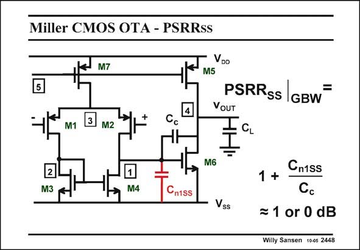

# SANSEN-2448 · Miller CMOS OTA - PSRRss

章节：24 数模混合集成电路中的耦合效应  
PDF 页：755；书本页：767；幻灯片编号：2448  
状态：unreviewed



## 对应教材讲解

### PDF 755 · 书本 767

At high frequencies, the situation is again somewhat more complicated. The dominant capacitances are added in the circuit schematic. They are the coupling capacitors between the supply line and node 1, the output of the input stage. Calculation of the PSRR shows however, SS that this capacitor is not that important. The PSRR SS is zero dB anyway. This means that any signal at the negative supply reaches the output terminal unattenuated. This clearly proves that single-ended opamps cannot be used for mixed-signal analog processing. What is the origin of this 0 dB?

### PDF 756 · 书本 768

At high frequencies, transistor M6 behaves as a small resistance with value 1/g . As a result m6 the negative line is nearly shorted to the output line. The attenuation from supply line to output is therefore zero.

## 公式／性能结论候选摘录

以下为规则截取的原文，尚未逐项判读。

- PDF 756: As a result m6 the negative line is nearly shorted to the output line.
- PDF 756: The attenuation from supply line to output is therefore zero.

## 曲线结论候选摘录

以下为规则截取的原文，尚未逐项判读。

（未由规则找到；不代表原页没有此类内容。）

## 原文条件与近似候选摘录

以下为规则截取的原文，尚未逐项判读。

（未由规则找到；不代表原页没有此类内容。）

## 幻灯片 OCR（未校正）

```text
Miller CMOS OTA - PSRRss
M7
5
VDD
M5
PSRRss
=
IGBW
VOUT
M1
M2
Cc
M6
2
M3
M4
Cniss
Vss
1 + Cniss
Cc
= 1 or 0 dB
Willy Sansen 1005 2448
```

数学上下标、分数及正负号以原图为准。电路图已保留；未核对的连接不输出成可仿真 netlist。
