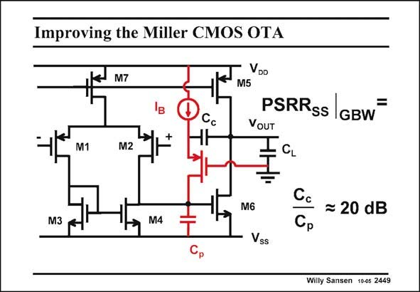

# SANSEN-2449 · Improving the Miller CMOS OTA

章节：24 数模混合集成电路中的耦合效应  
PDF 页：756；书本页：768；幻灯片编号：2449  
状态：unreviewed



## 对应教材讲解

### PDF 756 · 书本 768

One way to improve the PSRR is to a make com- SS pensation capacitor C unic directional. After all, it is this capacitor C which c turns transistor M6 into a resistor. The addition of a cascode, used very much to get rid of the positive zero (see Chapter 5), increases the PSRR from zero to a SS capacitance ratio, as for the other amplifiers. Values of the order of 20 dB (at the GBW) can now be expected. The actual calculation is shown next.

## 公式／性能结论候选摘录

以下为规则截取的原文，尚未逐项判读。

- PDF 756: The addition of a cascode, used very much to get rid of the positive zero (see Chapter 5), increases the PSRR from zero to a SS capacitance ratio, as for the other amplifiers.

## 曲线结论候选摘录

以下为规则截取的原文，尚未逐项判读。

（未由规则找到；不代表原页没有此类内容。）

## 原文条件与近似候选摘录

以下为规则截取的原文，尚未逐项判读。

（未由规则找到；不代表原页没有此类内容。）

## 幻灯片 OCR（未校正）

```text
Improving the Miller CMOS OTA
M1
M7
M2
Cc
VDo
M5
PSRRss |
GBW
VOUT
Ia
M6
= 20 dB
M3
M4
Ср
Vss
Willy Sansen 1005 2449
```

数学上下标、分数及正负号以原图为准。电路图已保留；未核对的连接不输出成可仿真 netlist。
