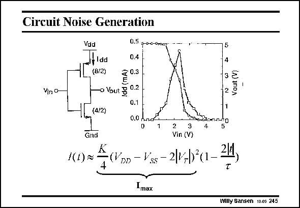

# SANSEN-245 · Circuit Noise Generation 0.5 фос-отк

章节：24 数模混合集成电路中的耦合效应  
PDF 页：733；书本页：745；幻灯片编号：245  
状态：unreviewed



## 对应教材讲解

### PDF 733 · 书本 745

Any digital gate causes transitions at its output from a logical zero to one, or viceversa. This transition causes a current spike from substrate to ground. As an example, a simple CMOS inverter is used. This current spike is then easily described, as shown in this slide. The size of this spike evidently depends on the sizes of the transistors used. Since thousands of digital gates are put together in a processor, the total current can be quite large and can have a wide frequency spectrum.

## 公式／性能结论候选摘录

以下为规则截取的原文，尚未逐项判读。

- PDF 733: The size of this spike evidently depends on the sizes of the transistors used.

## 曲线结论候选摘录

以下为规则截取的原文，尚未逐项判读。

（未由规则找到；不代表原页没有此类内容。）

## 原文条件与近似候选摘录

以下为规则截取的原文，尚未逐项判读。

（未由规则找到；不代表原页没有此类内容。）

## 幻灯片 OCR（未校正）

```text
Circuit Noise Generation
Vin O-
Vad
,Idd
(8/2)
0.5 фос-отк
0.4
-o Vout g 0.2
0.1
(4/2)
0.0 .
Gnd
/(1) *
DD
4
-3 ₴
2
2
3
Vin (V)
ss - 2/,
Imax
Willy Sansen 10-05 245
```

数学上下标、分数及正负号以原图为准。电路图已保留；未核对的连接不输出成可仿真 netlist。
