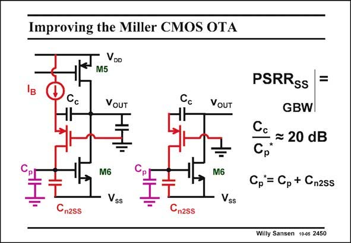

# SANSEN-2450 · Improving the Miller CMOS OTA

章节：24 数模混合集成电路中的耦合效应  
PDF 页：756；书本页：768；幻灯片编号：2450  
状态：unreviewed



## 对应教材讲解

### PDF 756 · 书本 768

A simplified schematic is shown in this slide, and an even more simplified one to the right. Calculation of the gain from the negative supply line V to the output shows SS that the parasitic capacitance at the input node of transistor M6 now plays a dominant role. Its ratio to the compensation capacitor C determines c the PSRR . For this reason, SS we may want to make C c larger. Remember, however, that the value of C determines the GBW, the stability and the integrated noise. So many c compromises have already come together in C ! c

## 公式／性能结论候选摘录

以下为规则截取的原文，尚未逐项判读。

- PDF 756: Calculation of the gain from the negative supply line V to the output shows SS that the parasitic capacitance at the input node of transistor M6 now plays a dominant role.

## 曲线结论候选摘录

以下为规则截取的原文，尚未逐项判读。

（未由规则找到；不代表原页没有此类内容。）

## 原文条件与近似候选摘录

以下为规则截取的原文，尚未逐项判读。

（未由规则找到；不代表原页没有此类内容。）

## 幻灯片 OCR（未校正）

```text
Improving the Miller CMOS OTA
Voo
M5
Cc
VOUT
Cc
VOUT
M6
Vss
M6
Vss
Cn2ss
Cn2ss
PSRRss
=
GBW|
Cc
C, * 20 dB
Cp*= Cp + Gnzss
Willy Sansen 1005 2450
```

数学上下标、分数及正负号以原图为准。电路图已保留；未核对的连接不输出成可仿真 netlist。
