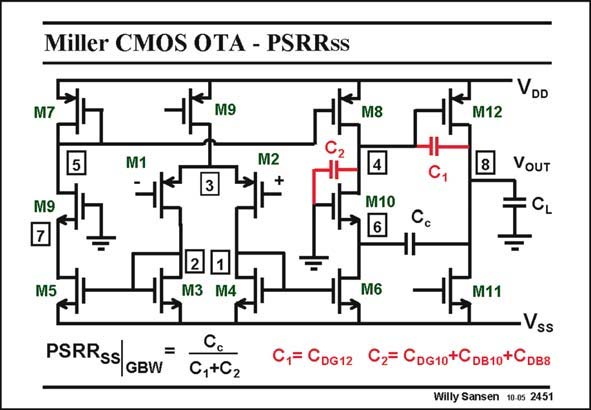

# SANSEN-2451 · Miller CMOS OTA - PSRRss

章节：24 数模混合集成电路中的耦合效应  
PDF 页：757；书本页：769；幻灯片编号：2451  
状态：unreviewed



## 对应教材讲解

### PDF 757 · 书本 769

Another two-stage Miller amplifier is shown in this slide. It uses a symmetrical OTA as a first stage. Cascodes are used as well. It is therefore evident that the compensation capacitor is led through a cascode, which is here M10. As a result the PSRR is SS enhanced as well. The actual expression is shown in this slide. It is a ratio of capacitors involving a large number of parasitic capacitances. It will be larger than 0 dB, but not significantly!

## 公式／性能结论候选摘录

以下为规则截取的原文，尚未逐项判读。

- PDF 757: It is therefore evident that the compensation capacitor is led through a cascode, which is here M10.
- PDF 757: As a result the PSRR is SS enhanced as well.

## 曲线结论候选摘录

以下为规则截取的原文，尚未逐项判读。

（未由规则找到；不代表原页没有此类内容。）

## 原文条件与近似候选摘录

以下为规则截取的原文，尚未逐项判读。

（未由规则找到；不代表原页没有此类内容。）

## 幻灯片 OCR（未校正）

```text
Miller CMOS OTA - PSRRss
VDD
M7
M9
M8
M12
M1
M2
8
VOUT
M9
M10
M5
2
M3 M4
M6
M11
PSRRSs
GBW
=
1= CDG 12
C,+C2
Vss
Cz= CDg10+CDB10+CDB8
Willy Sansen 10 0s 2451
```

数学上下标、分数及正负号以原图为准。电路图已保留；未核对的连接不输出成可仿真 netlist。
