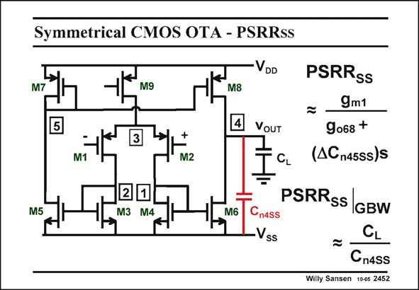

# SANSEN-2452 · Symmetrical CMOS OTA - PSRRss

章节：24 数模混合集成电路中的耦合效应  
PDF 页：757；书本页：769；幻灯片编号：2452  
状态：unreviewed



## 对应教材讲解

### PDF 757 · 书本 769

The PSRR for a symmetri- SS cal OTA by itself is shown in this slide. It is mainly determined by mismatches. At low frequencies it is determined by the resistance at node 5. At high frequencies (at GBW) however, it is determined by the difference in coupling capacitance from the supply line to the nodes 4 and 5. Because node 4 is the output node and node 5 is not, the coupling capacitor C is likely to be much n4SS larger than the one on the other side C . n5SS As a result, the simplest expression of the PSRR is the ratio of C to this coupling capacitor SS L C . Again, values of 20 dB can be expected. n4SS

## 公式／性能结论候选摘录

以下为规则截取的原文，尚未逐项判读。

- PDF 757: Because node 4 is the output node and node 5 is not, the coupling capacitor C is likely to be much n4SS larger than the one on the other side C . n5SS As a result, the simplest expression of the PSRR is the ratio of C to this coupling capacitor SS L C .

## 曲线结论候选摘录

以下为规则截取的原文，尚未逐项判读。

（未由规则找到；不代表原页没有此类内容。）

## 原文条件与近似候选摘录

以下为规则截取的原文，尚未逐项判读。

（未由规则找到；不代表原页没有此类内容。）

## 幻灯片 OCR（未校正）

```text
Symmetrical CMOS OTA - PSRRss
VDD
M
M9
5
M8
4
3
M1
+
M2
M5
2
M3
M4
M6
VOUT
CL
PSRRss
9m1
9068 +
(ACn45ss)S
PSRRss
CnAss
IGBW
•Vss
CL
Cn4SS
Willy Sansen 10-05 2452
```

数学上下标、分数及正负号以原图为准。电路图已保留；未核对的连接不输出成可仿真 netlist。
