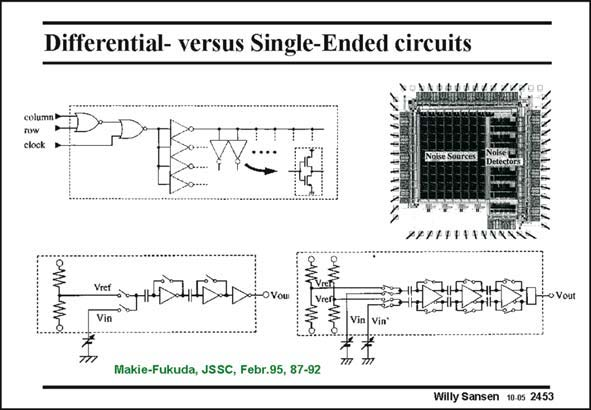

# SANSEN-2453 · Differential- versus Single-Ended circuits

章节：24 数模混合集成电路中的耦合效应  
PDF 页：758；书本页：770；幻灯片编号：2453  
状态：unreviewed



## 对应教材讲解

### PDF 758 · 书本 770

Experimental evidence on PSRR is not easily found. One example is shown in this slide. The PSRR has been measured for both a singleended as for a fullydifferential switched-capacitor amplifier. They act as a receiver. The noise sources are a number of logic gates and inverters, as shown on top. A smaller or larger number of logic gates can be switched in.

## 公式／性能结论候选摘录

以下为规则截取的原文，尚未逐项判读。

（未由规则找到；不代表原页没有此类内容。）

## 曲线结论候选摘录

以下为规则截取的原文，尚未逐项判读。

（未由规则找到；不代表原页没有此类内容。）

## 原文条件与近似候选摘录

以下为规则截取的原文，尚未逐项判读。

（未由规则找到；不代表原页没有此类内容。）

## 幻灯片 OCR（未校正）

```text
Differential- versus Single-Ended circuits
now
clock
Vref
-OVou
› Vout
Vin
Makie-Fukuda, JSSC, Febr.95, 87-92
Willy Sansen 10 0s 2453
```

数学上下标、分数及正负号以原图为准。电路图已保留；未核对的连接不输出成可仿真 netlist。
