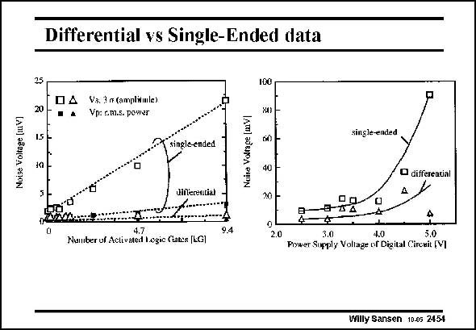

# SANSEN-2454 · Differential vs Single-Ended data

章节：24 数模混合集成电路中的耦合效应  
PDF 页：758；书本页：770；幻灯片编号：2454  
状态：unreviewed



## 对应教材讲解

### PDF 758 · 书本 770

The noise voltage is measured at the output of the analog amplifier structure. It is clear that the singleended amplifier is much more sensitive to the digital noise than the fully-differential one. Increasing the supply voltage increases the currents in the logic gates and also the spike current transfer to the analog circuits. This is clearly visible on the right. Even the differential noise pick up increases rather drastically. This is probably due to mismatch in substrate contacts. Quite often many sources of mismatch are often overlooked. For example for a fully-differential input stage of an opamp, good matching not only requires perfectly symmetrical layout but also identical surroundings. For example, the substrate contacts of the input transistors must also have the same size and an equal distance to the axis of symmetry. If not, different substrate resistances result, and different body effects.

## 公式／性能结论候选摘录

以下为规则截取的原文，尚未逐项判读。

- PDF 758: Increasing the supply voltage increases the currents in the logic gates and also the spike current transfer to the analog circuits.
- PDF 758: Even the differential noise pick up increases rather drastically.
- PDF 758: For example, the substrate contacts of the input transistors must also have the same size and an equal distance to the axis of symmetry.

## 曲线结论候选摘录

以下为规则截取的原文，尚未逐项判读。

- PDF 758: For example, the substrate contacts of the input transistors must also have the same size and an equal distance to the axis of symmetry.

## 原文条件与近似候选摘录

以下为规则截取的原文，尚未逐项判读。

（未由规则找到；不代表原页没有此类内容。）

## 幻灯片 OCR（未校正）

```text
Differential vs Single-Ended data
25
20
15
04
Vs. 3 a (amplimle)
Vp: r.m.s. power
100
XI)
single-ended
single-ended
diferential
40
20
• differeatial
Number of Activateil Logic fiak:s LGl
9.4
A-2Д
2.0
Power Sirply Voliage IN Digial Chreai (V1
Willy Sansen 10.05 2454
```

数学上下标、分数及正负号以原图为准。电路图已保留；未核对的连接不输出成可仿真 netlist。
