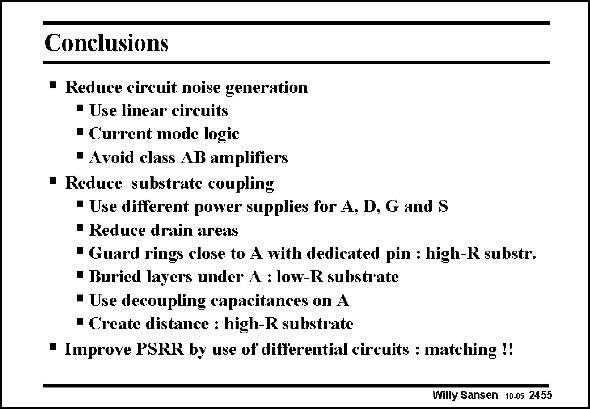

# SANSEN-2455 · Conclusions • Reduce circuit noise generation

章节：24 数模混合集成电路中的耦合效应  
PDF 页：759；书本页：771；幻灯片编号：2455  
状态：unreviewed



## 对应教材讲解

### PDF 759 · 书本 771

As a conclusion, several measures are again repeated, to avoid coupling from the digital noise sources to the analog amplifiers. They are listed in this slide. Most of these have been discussed previously and therefore speak for themselves. It is clear that only fullydifferential circuits can be used in mixed-signal systems. Moreover, the layout must be carried out with extreme attention towards symmetry.

## 公式／性能结论候选摘录

以下为规则截取的原文，尚未逐项判读。

- PDF 759: As a conclusion, several measures are again repeated, to avoid coupling from the digital noise sources to the analog amplifiers.
- PDF 759: Most of these have been discussed previously and therefore speak for themselves.

## 曲线结论候选摘录

以下为规则截取的原文，尚未逐项判读。

（未由规则找到；不代表原页没有此类内容。）

## 原文条件与近似候选摘录

以下为规则截取的原文，尚未逐项判读。

（未由规则找到；不代表原页没有此类内容。）

## 幻灯片 OCR（未校正）

```text
Conclusions
• Reduce circuit noise generation
• Use linear circuits
• Current mode logic
• Avoid class AB amplifiers
• Reduce substrate coupling
• Use difterent power supplies for A, D, G and S
• Reduce drain areas
• Guard rings close to A with dedicated pin : high-R substr.
• Buried layers under A : low-R substrate
• Use decoupling capacitances on A
• Create distance : high-R substrate
• Improve PSRR by use of ditlerential circuits : matching!
Willy Sansen 10.05 2455
```

数学上下标、分数及正负号以原图为准。电路图已保留；未核对的连接不输出成可仿真 netlist。
