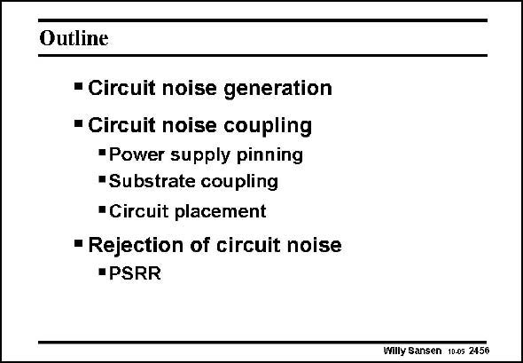

# SANSEN-2456 · Slide 2456

章节：24 数模混合集成电路中的耦合效应  
PDF 页：759；书本页：771；幻灯片编号：2456  
状态：unreviewed



## 对应教材讲解

### PDF 759 · 书本 771

In this Chapter, an overview has been given on what are the possible mechanisms of coupling between digital and analog blocks. They have all been identified. Also, a number of design considerations have been added to improve the isolation. Some of these have to do with technology and some others with design. Again, mismatch seems to have emerged as the main stumbling block. This is hardly surprising as mismatch has been the stumbling block for many other specifications as well. It is therefore one of the main concerns for any analog designer!

## 公式／性能结论候选摘录

以下为规则截取的原文，尚未逐项判读。

- PDF 759: It is therefore one of the main concerns for any analog designer!

## 曲线结论候选摘录

以下为规则截取的原文，尚未逐项判读。

（未由规则找到；不代表原页没有此类内容。）

## 原文条件与近似候选摘录

以下为规则截取的原文，尚未逐项判读。

（未由规则找到；不代表原页没有此类内容。）

## 幻灯片 OCR（未校正）

```text
Outline
- Circuit noise generation
• Circuit noise coupling
•Power supply pinning
•Substrate coupling
•Circuit placement
- Rejection of circuit noise
•PSRR
Willy Sansen 10.05 2456
```

数学上下标、分数及正负号以原图为准。电路图已保留；未核对的连接不输出成可仿真 netlist。
