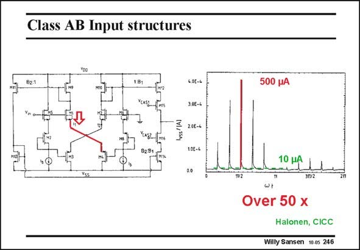

# SANSEN-246 · Class AB Input structures

章节：24 数模混合集成电路中的耦合效应  
PDF 页：733；书本页：745；幻灯片编号：246  
状态：unreviewed



## 对应教材讲解

### PDF 733 · 书本 745

However, analog circuits can also cause current spikes. For example, class- AB stages draw currents which are larger than their quiescent current. As an example, look at the class-AB input stage shown in this slide. For large input voltages, the currents can become quite large. When the current is monitored through the positive supply line. Large current spikes are visible, nearly 50 times the quiescent current. Evidently, this amplifier is used in a switched-capacitor filter. At each clock cycle, the opamp is driven hard, causing these current spikes to flow. An important compromise is now to be taken. Class AB circuits allow considerable reduction in quiescent power consumption. On the other hand, they cause current spikes which may impair the SNR.

## 公式／性能结论候选摘录

以下为规则截取的原文，尚未逐项判读。

（未由规则找到；不代表原页没有此类内容。）

## 曲线结论候选摘录

以下为规则截取的原文，尚未逐项判读。

（未由规则找到；不代表原页没有此类内容。）

## 原文条件与近似候选摘录

以下为规则截取的原文，尚未逐项判读。

（未由规则找到；不代表原页没有此类内容。）

## 幻灯片 OCR（未校正）

```text
Class AB Input structures
Yoo
B2:1
181
266-4
10E-4
500 pA
10 pA
Over 50 x
Halonen, CICC
Willy Sansen 10.05 246
```

数学上下标、分数及正负号以原图为准。电路图已保留；未核对的连接不输出成可仿真 netlist。
