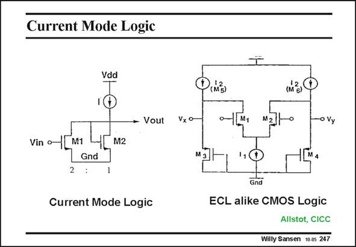

# SANSEN-247 · Current Mode Logic

章节：24 数模混合集成电路中的耦合效应  
PDF 页：734；书本页：746；幻灯片编号：247  
状态：unreviewed



## 对应教材讲解

### PDF 734 · 书本 746

Do all digital gates cause current spikes? The answer is negative. Current spikes are typical for CMOS logic. No current is consumed in either the zero output state or the output state. Current is only consumed during the transition. This is the strength of CMOS logic. The static power consumption is very low but increases with the clock frequency. Several other loc families exist which consume current continuously. ECL in bipolar technology or current-mode logic in CMOS (see slide) are good examples. As current is consumed continuously, the power consumption is high. The advantage however, is that the current spikes are hardly visible.

## 公式／性能结论候选摘录

以下为规则截取的原文，尚未逐项判读。

- PDF 734: The static power consumption is very low but increases with the clock frequency.

## 曲线结论候选摘录

以下为规则截取的原文，尚未逐项判读。

（未由规则找到；不代表原页没有此类内容。）

## 原文条件与近似候选摘录

以下为规则截取的原文，尚未逐项判读。

（未由规则找到；不代表原页没有此类内容。）

## 幻灯片 OCR（未校正）

```text
Current Mode Logic
Vdd
- Vout
Vin o-
M1
2
M2
Gnd
Current Mode Logic
Vx o
(nh 3)
0-
-o Vy
Gnd
ECL alike CMOS Logic
Allstot, CICC
Willy Sansen 10-0s 247
```

数学上下标、分数及正负号以原图为准。电路图已保留；未核对的连接不输出成可仿真 netlist。
