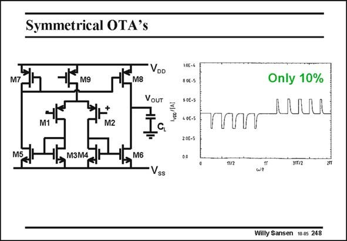

# SANSEN-248 · Symmetrical OTA's

章节：24 数模混合集成电路中的耦合效应  
PDF 页：734；书本页：746；幻灯片编号：248  
状态：unreviewed



## 对应教材讲解

### PDF 734 · 书本 746

Even class-A amplifiers can cause current spikes. An example is shown in this slide of a symmetrical class-A OTA. When it is used in a switched-capacitor filter, current spikes are found at each clock cycle. Indeed, charging load capacitance C fast, generates a current L spike from the positive supply through M8 and C . L In the same way, will the discharge of this load capacitance C cause a cur- L rent spike through M6 to ground? These spikes are not as large as in a class-AB circuit, they are not invisible, however.

## 公式／性能结论候选摘录

以下为规则截取的原文，尚未逐项判读。

（未由规则找到；不代表原页没有此类内容。）

## 曲线结论候选摘录

以下为规则截取的原文，尚未逐项判读。

（未由规则找到；不代表原页没有此类内容。）

## 原文条件与近似候选摘录

以下为规则截取的原文，尚未逐项判读。

（未由规则找到；不代表原页没有此类内容。）

## 幻灯片 OCR（未校正）

```text
Symmetrical OTA's
M9
M8
VDD
Vour
M1
M2
M3M4
Vss
S0E-S
4 0E-5
202-5
0.0
Only 10%
LUULL
Tu2
3112
Willy Sansen 10-0s 248
```

数学上下标、分数及正负号以原图为准。电路图已保留；未核对的连接不输出成可仿真 netlist。
