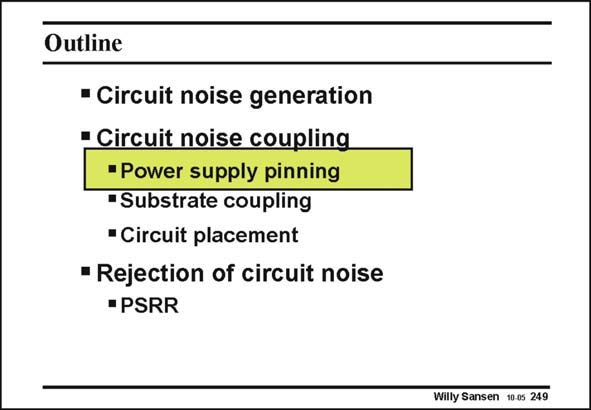

# SANSEN-249 · Slide 249

章节：24 数模混合集成电路中的耦合效应  
PDF 页：735；书本页：747；幻灯片编号：249  
状态：unreviewed



## 对应教材讲解

### PDF 735 · 书本 747

Now that it is clear that both digital and analog circuits generate plenty of current spikes, it has to be figured out how they can be prevented from traveling to the other side of the substrate, where the analog input stages are detecting whatever reaches their gates or substrates underneath. The distribution of the pins plays an important role. It is discussed first. The longitudinal transmission through the substrate is another important factor. Finally, layout techniques can be used to reduce coupling.

## 公式／性能结论候选摘录

以下为规则截取的原文，尚未逐项判读。

（未由规则找到；不代表原页没有此类内容。）

## 曲线结论候选摘录

以下为规则截取的原文，尚未逐项判读。

（未由规则找到；不代表原页没有此类内容。）

## 原文条件与近似候选摘录

以下为规则截取的原文，尚未逐项判读。

（未由规则找到；不代表原页没有此类内容。）

## 幻灯片 OCR（未校正）

```text
Outline
• Circuit noise generation
• Circuit noise coupling
"Power supply pinning
"Substrate coupling
•Circuit placement
• Rejection of circuit noise
• PSRR
Willy Sansen 10 05 249
```

数学上下标、分数及正负号以原图为准。电路图已保留；未核对的连接不输出成可仿真 netlist。
