# 第二章：Spectre 仿真与推导对照

本轮使用远程 **Cadence Spectre 18.1.0.077** 实际运行网表，通过 `virtuoso-bridge-lite 0.8.0` 下载原始 PSF。涵盖 20 组推导的代表模型；以下清楚列出每个电路与检查，没有将它等同于逐一完成所有幻灯片电路。

## 结果总览

| 验证 | 数量 | 结果 |
|---|---:|---|
| 显式元件的小信号 AC | 32 | 全部通过 |
| gm/Id 法确定尺寸的 MOS1 电路 AC | 7 | 全部通过 |
| 直接极零分析 | 5 | 全部通过 |
| 极零对／基准瞬态 | 3 | 全部通过 |
| MOS 工作区 | 10 只 | 全部在饱和区 |

比较完整式时，AC 与极零位置容许相对误差为 $2\times10^{-5}$；瞬态容许归一化输出的绝对误差为 $2\times10^{-5}$。线性 AC 最大误差约 $1.59\times10^{-5}$，MOS AC 约 $4.69\times10^{-6}$，极零位置约 $1.93\times10^{-6}$。原始 PSF 有输出有效位数限制。

[完整验证记录](verification.json) · [gm/Id 选点与尺寸](gmid_selection.json) · [MOS 工作点](mos_operating_points.json)

## 模型与仿真层级

1. **线性元件模型**：使用真正的 Spectre resistor、capacitor、inductor、vccs、vcvs 创建连接。KCL 闭式公式另由 Python 计算，不把完整 H(s) 塞进单个行为源再称作电路验证。增益增强的辅助极点用实际 R/C 实现。
2. **晶体管模型**：使用明列常数的 MOS1 教学模型，从 DC 扫描取得 gm/Id 与电流密度，选工作点与尺寸，再用 Spectre 求 DC／AC。
3. **结果比对**：MOS 仿真保留其本征 Cgs；把实际工作点的 gm、gds、电容代入相应完整小信号式。另列教材简式的近似偏差，不把近似失效混成仿真失败。

没有指定晶圆厂 PDK，因此本轮不作工艺、工艺角、蒙特卡洛 或版图寄生验证。线性 AC 扫至 1 THz、MOS AC 扫至 10 GHz，是检查指定数学模型的极限；这些上限不代表长沟道 MOS 实际可用带宽。

## gm/Id：先扫描，再选工作点与尺寸

NMOS／PMOS 各以 $W=20$ µm、$L=2$ µm、$|V_{DS}|=1$ V，扫描 $V_{OV}=0.05$–$0.60$ V，步长 5 mV。教学模型采 $|V_T|=0.45$ V、$KP=100$ µA/V²、$\lambda=0.1$ V⁻¹、$\gamma=0$、$t_{ox}=10$ nm。其余参数与引脚 D/G/S/B 顺序保存在网表。

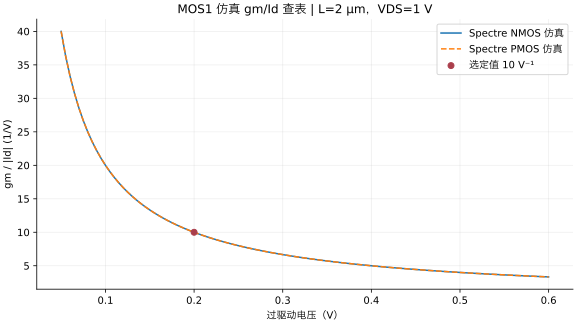

从仿真曲线选 $g_m/I_D=10$ V⁻¹，对应 $V_{OV}=0.2$ V；沿用 029 的 $GBW=100$ MHz、$C_L=3$ pF：

$$g_{m,\mathrm{target}}=2\pi(100\,\mathrm{MHz})(3\,\mathrm{pF})=1.88496\,\mathrm{mS}.$$

$$I_{D,\mathrm{target}}=g_{m,\mathrm{target}}/(g_m/I_D)=188.496\,\mu\mathrm A.$$

$$W=\frac{I_{D,\mathrm{target}}}{I_{D,\mathrm{lookup}}/W_{\mathrm{lookup}}}=171.360\,\mu\mathrm m,\qquad L=2\,\mu\mathrm m.$$

教材忽略沟道长度调制的尺寸式给 $W=188.496$ µm；本次 MOS1 电流含 $(1+\lambda V_{DS})=1.1$，因此查表选出的 W 较小。这是可解释的模型差异，没有直接把教材尺寸当成 PDK 尺寸。

[MOS1 查表网表](netlists/gmid_characterization.scs) · [完整查表 CSV](csv/gmid_lookup.csv) · [七个 MOS 电路网表](netlists/mos_validation.scs)

## 直接极零分析

使用 Spectre `pz`，并设 `docancel=no`，因此可以看到相消前重叠的极点与零点。PSF 中的位置单位是 Hz；与理论根 $s$ 比较前先除以 $2\pi$。

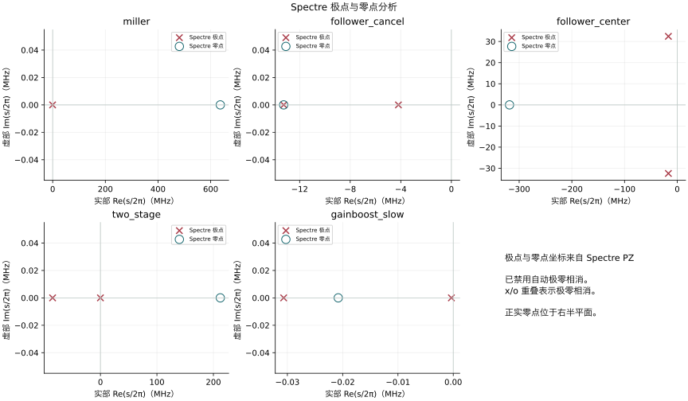

- 米勒右半平面零点约 **+636.620 MHz**。
- 两级米勒补偿右半平面零点约 **+212.207 MHz**。
- 跟随器相消案例在 **−13.2629 MHz** 有重叠极点／零点，剩余主极点约 **−4.18829 MHz**。
- 跟随器复极点案例得到共轭极点，与二次分母判别式一致。

[极零解析值与理论值](pz_results.json)

## 极零对与建立过程

闭环由受控源、积分电容及一个 R/C 极点构成。输入为延迟 1 µs、上升时间 1 ns 的阶跃；理论参考对有限上升时间作了积分，避免把理想瞬时阶跃误差算给 Spectre。

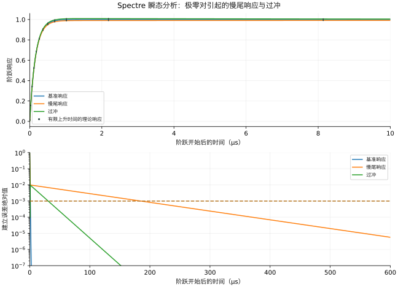

单极点基准达到 0.1% 误差约需 **1.101 µs**；具有极零对引起的慢尾响应的案例约需 **184.641 µs**。另有一个慢速留数为负的案例呈现过冲，约 **30.741 µs** 进入 0.1% 范围。建立时间依下载波形的最后超差点估算，其时间分辨率受保存样点限制。

[瞬态网表](netlists/doublet_transient.scs) · [瞬态验证数值](transient_results.json)

## 逐组电路、波形与近似差异

### 01 · 单管增益与 MOS／BJT 比较

本推导组的代表模型已完成 Spectre 验证；覆盖范围以所列网表为准，未逐一搭建所有幻灯片电路。

[完整公式推导](../../derivations/ch02/01-intrinsic-gain.html)

#### intrinsic · 显式小信号组件

由 Spectre 输出的复数波形，逐频点与完整式比较；相位与正负号均纳入。
最大相对误差：**5e-08**；保存点数：721。

教材近似式另行比较：在 1 Hz–1 MHz，最大相对偏差为 **0%**。此数字与完整式验证分开；橙色虚线显示近似式。

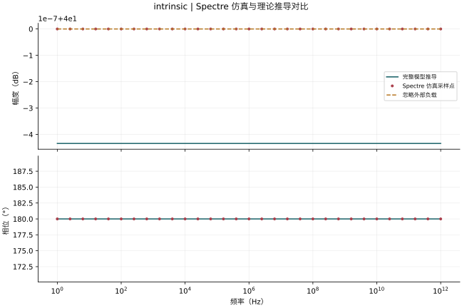

[波形 CSV](csv/intrinsic.csv) · [运行网表](netlists/linear_suite.scs)

### 02 · 单极点、GBW 与尺寸数值题

本推导组的代表模型已完成 Spectre 验证；覆盖范围以所列网表为准，未逐一搭建所有幻灯片电路。

[完整公式推导](../../derivations/ch02/02-single-pole.html)

#### loaded_cs · 显式小信号组件

由 Spectre 输出的复数波形，逐频点与完整式比较；相位与正负号均纳入。
最大相对误差：**4.57e-06**；保存点数：721。

教材近似式另行比较：在 1 Hz–1 MHz，最大相对偏差为 **7.36e-05%**。此数字与完整式验证分开；橙色虚线显示近似式。

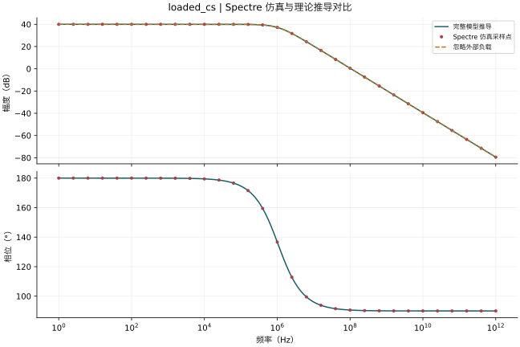

[波形 CSV](csv/loaded_cs.csv) · [运行网表](netlists/linear_suite.scs)

#### mos_cs · MOS1 教学晶体管

由 Spectre 输出的复数波形，逐频点与完整式比较；相位与正负号均纳入。
最大相对误差：**4.57e-06**；保存点数：601。

DC 输出：1 V；所有器件通过饱和区检查。完整式使用实际工作点的 gm、gds 与 Cgs。

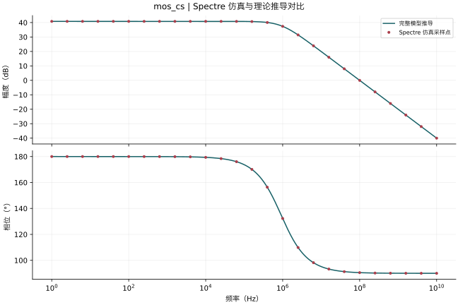

[波形 CSV](csv/mos_cs.csv) · [运行网表](netlists/mos_validation.scs)

### 03 · 米勒反馈与 RHP 零点

本推导组的代表模型已完成 Spectre 验证；覆盖范围以所列网表为准，未逐一搭建所有幻灯片电路。

[完整公式推导](../../derivations/ch02/03-miller.html)

#### miller · 显式小信号组件

由 Spectre 输出的复数波形，逐频点与完整式比较；相位与正负号均纳入。
最大相对误差：**4.17e-06**；保存点数：721。

教材近似式另行比较：在 1 Hz–1 MHz，最大相对偏差为 **5.77%**。此数字与完整式验证分开；橙色虚线显示近似式。

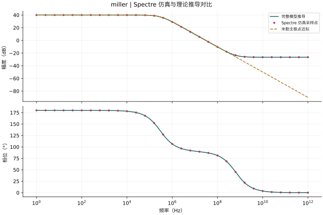

[波形 CSV](csv/miller.csv) · [运行网表](netlists/linear_suite.scs)

#### miller_low_rs · 显式小信号组件

由 Spectre 输出的复数波形，逐频点与完整式比较；相位与正负号均纳入。
最大相对误差：**3.77e-06**；保存点数：721。

教材近似式另行比较：在 1 Hz–1 MHz，最大相对偏差为 **15.9%**。此数字与完整式验证分开；橙色虚线显示近似式。

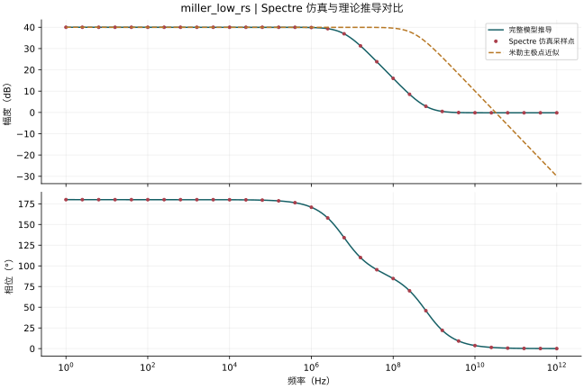

[波形 CSV](csv/miller_low_rs.csv) · [运行网表](netlists/linear_suite.scs)

#### miller_high_rs · 显式小信号组件

由 Spectre 输出的复数波形，逐频点与完整式比较；相位与正负号均纳入。
最大相对误差：**4.63e-06**；保存点数：721。

教材近似式另行比较：在 1 Hz–1 MHz，最大相对偏差为 **1.06%**。此数字与完整式验证分开；橙色虚线显示近似式。

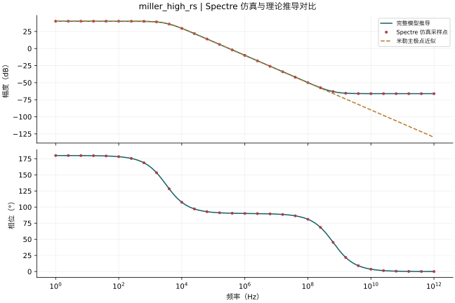

[波形 CSV](csv/miller_high_rs.csv) · [运行网表](netlists/linear_suite.scs)

#### mos_miller · MOS1 教学晶体管

由 Spectre 输出的复数波形，逐频点与完整式比较；相位与正负号均纳入。
最大相对误差：**4.5e-06**；保存点数：601。

DC 输出：1 V；所有器件通过饱和区检查。完整式使用实际工作点的 gm、gds 与 Cgs。

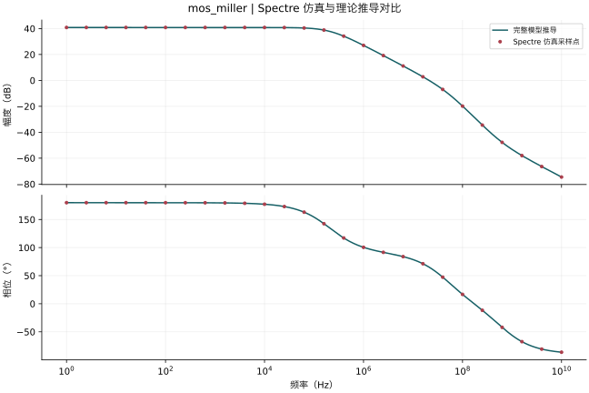

[波形 CSV](csv/mos_miller.csv) · [运行网表](netlists/mos_validation.scs)

本组另有直接 PZ 结果：miller。详见上方极零图与 JSON。

### 04 · 源极负反馈与可调跨导

本推导组的代表模型已完成 Spectre 验证；覆盖范围以所列网表为准，未逐一搭建所有幻灯片电路。

[完整公式推导](../../derivations/ch02/04-degeneration.html)

#### degeneration · 显式小信号组件

由 Spectre 输出的复数波形，逐频点与完整式比较；相位与正负号均纳入。
最大相对误差：**2e-08**；保存点数：721。

教材近似式另行比较：在 1 Hz–1 MHz，最大相对偏差为 **61%**。此数字与完整式验证分开；橙色虚线显示近似式。

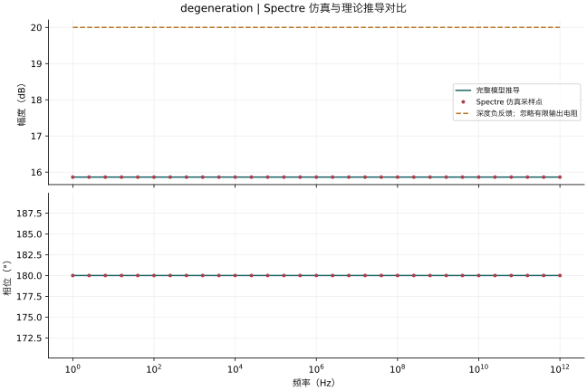

[波形 CSV](csv/degeneration.csv) · [运行网表](netlists/linear_suite.scs)

#### degeneration_zin · 显式小信号组件

由 Spectre 输出的复数波形，逐频点与完整式比较；相位与正负号均纳入。
最大相对误差：**1.59e-05**；保存点数：721。

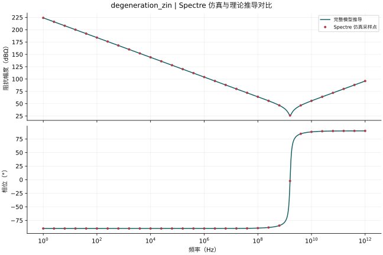

[波形 CSV](csv/degeneration_zin.csv) · [运行网表](netlists/linear_suite.scs)

#### mos_degen · MOS1 教学晶体管

由 Spectre 输出的复数波形，逐频点与完整式比较；相位与正负号均纳入。
最大相对误差：**4.23e-06**；保存点数：601。

DC 输出：1.2 V；所有器件通过饱和区检查。完整式使用实际工作点的 gm、gds 与 Cgs。

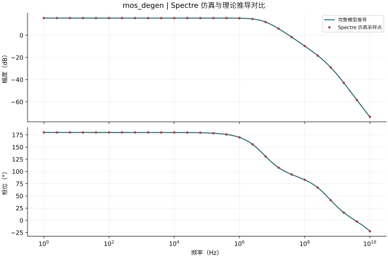

[波形 CSV](csv/mos_degen.csv) · [运行网表](netlists/mos_validation.scs)

### 05 · 二极管连接与有源负载

本推导组的代表模型已完成 Spectre 验证；覆盖范围以所列网表为准，未逐一搭建所有幻灯片电路。

[完整公式推导](../../derivations/ch02/05-diode-loads.html)

#### diode_z · 显式小信号组件

由 Spectre 输出的复数波形，逐频点与完整式比较；相位与正负号均纳入。
最大相对误差：**4.55e-06**；保存点数：721。

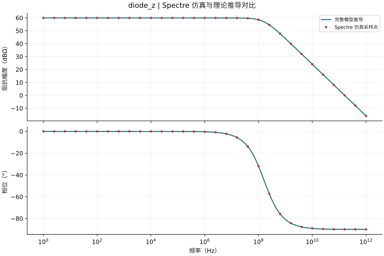

[波形 CSV](csv/diode_z.csv) · [运行网表](netlists/linear_suite.scs)

#### diode_load · 显式小信号组件

由 Spectre 输出的复数波形，逐频点与完整式比较；相位与正负号均纳入。
最大相对误差：**3.98e-06**；保存点数：721。

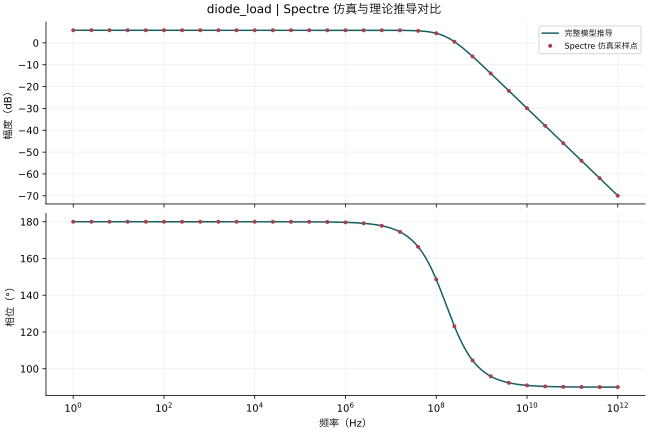

[波形 CSV](csv/diode_load.csv) · [运行网表](netlists/linear_suite.scs)

#### mos_diode_load · MOS1 教学晶体管

由 Spectre 输出的复数波形，逐频点与完整式比较；相位与正负号均纳入。
最大相对误差：**3.29e-06**；保存点数：601。

DC 输出：0.65 V；所有器件通过饱和区检查。完整式使用实际工作点的 gm、gds 与 Cgs。

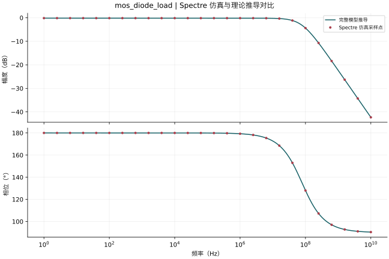

[波形 CSV](csv/mos_diode_load.csv) · [运行网表](netlists/mos_validation.scs)

### 06 · CMOS 反相器：DC 与匹配

本推导组的代表模型已完成 Spectre 验证；覆盖范围以所列网表为准，未逐一搭建所有幻灯片电路。

[完整公式推导](../../derivations/ch02/06-inverter-dc.html)

#### inverter_dc · 显式小信号组件

由 Spectre 输出的复数波形，逐频点与完整式比较；相位与正负号均纳入。
最大相对误差：**4e-06**；保存点数：721。

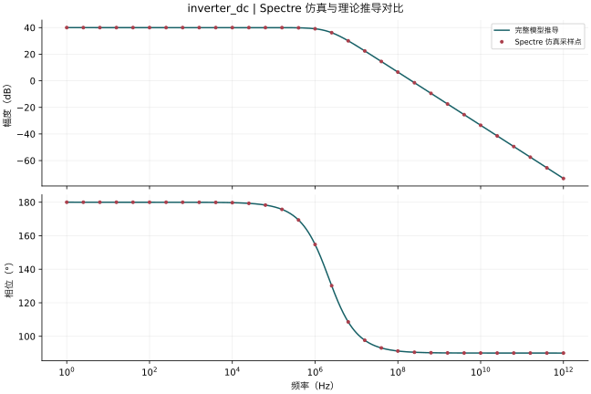

[波形 CSV](csv/inverter_dc.csv) · [运行网表](netlists/linear_suite.scs)

### 07 · CMOS 反相器：完整频率响应

本推导组的代表模型已完成 Spectre 验证；覆盖范围以所列网表为准，未逐一搭建所有幻灯片电路。

[完整公式推导](../../derivations/ch02/07-inverter-ac.html)

#### inverter_ac · 显式小信号组件

由 Spectre 输出的复数波形，逐频点与完整式比较；相位与正负号均纳入。
最大相对误差：**4.82e-06**；保存点数：721。

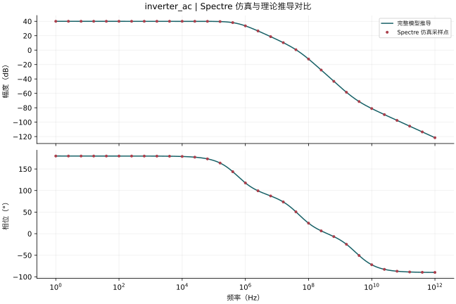

[波形 CSV](csv/inverter_ac.csv) · [运行网表](netlists/linear_suite.scs)

#### mos_inverter · MOS1 教学晶体管

由 Spectre 输出的复数波形，逐频点与完整式比较；相位与正负号均纳入。
最大相对误差：**4.69e-06**；保存点数：601。

DC 输出：0.65 V；所有器件通过饱和区检查。完整式使用实际工作点的 gm、gds 与 Cgs。

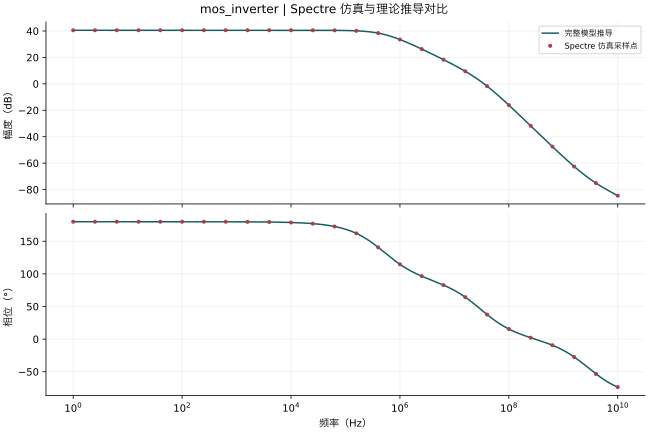

[波形 CSV](csv/mos_inverter.csv) · [运行网表](netlists/mos_validation.scs)

### 08 · 源极与射极跟随器：DC

本推导组的代表模型已完成 Spectre 验证；覆盖范围以所列网表为准，未逐一搭建所有幻灯片电路。

[完整公式推导](../../derivations/ch02/08-followers-dc.html)

#### follower_dc · 显式小信号组件

由 Spectre 输出的复数波形，逐频点与完整式比较；相位与正负号均纳入。
最大相对误差：**4.36e-06**；保存点数：721。

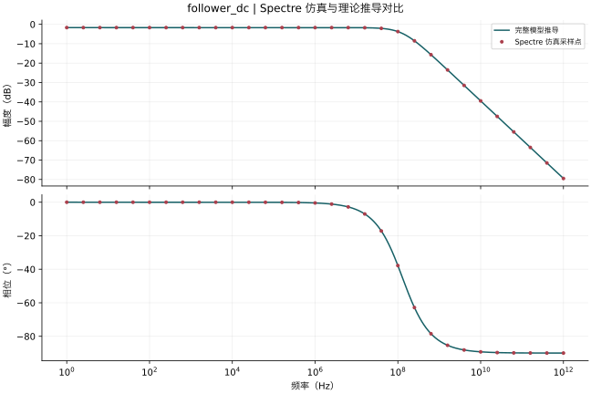

[波形 CSV](csv/follower_dc.csv) · [运行网表](netlists/linear_suite.scs)

### 09 · 源极跟随器：极点、零点与峰化

本推导组的代表模型已完成 Spectre 验证；覆盖范围以所列网表为准，未逐一搭建所有幻灯片电路。

[完整公式推导](../../derivations/ch02/09-followers-hf.html)

#### follower_cancel · 显式小信号组件

由 Spectre 输出的复数波形，逐频点与完整式比较；相位与正负号均纳入。
最大相对误差：**4.06e-06**；保存点数：721。

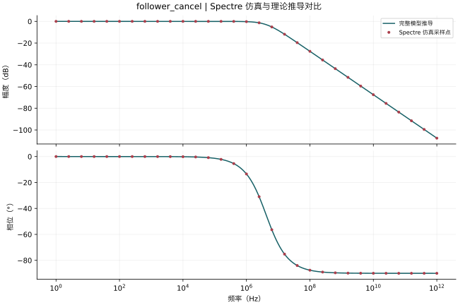

[波形 CSV](csv/follower_cancel.csv) · [运行网表](netlists/linear_suite.scs)

#### follower_cancel_z · 显式小信号组件

由 Spectre 输出的复数波形，逐频点与完整式比较；相位与正负号均纳入。
最大相对误差：**4.28e-06**；保存点数：721。

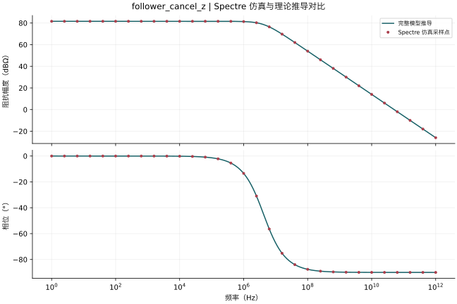

[波形 CSV](csv/follower_cancel_z.csv) · [运行网表](netlists/linear_suite.scs)

#### follower_book · 显式小信号组件

由 Spectre 输出的复数波形，逐频点与完整式比较；相位与正负号均纳入。
最大相对误差：**3.96e-06**；保存点数：721。

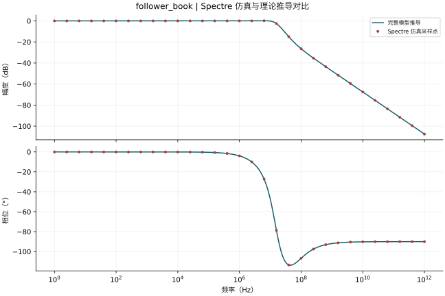

[波形 CSV](csv/follower_book.csv) · [运行网表](netlists/linear_suite.scs)

#### follower_book_z · 显式小信号组件

由 Spectre 输出的复数波形，逐频点与完整式比较；相位与正负号均纳入。
最大相对误差：**4.41e-06**；保存点数：721。

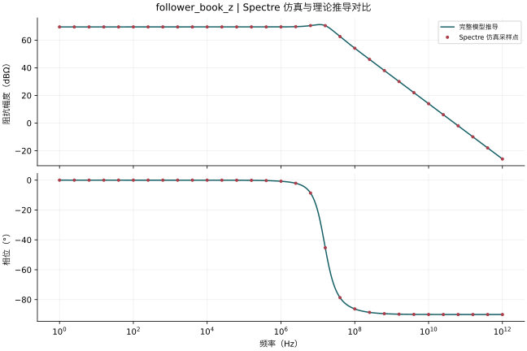

[波形 CSV](csv/follower_book_z.csv) · [运行网表](netlists/linear_suite.scs)

#### follower_center · 显式小信号组件

由 Spectre 输出的复数波形，逐频点与完整式比较；相位与正负号均纳入。
最大相对误差：**5e-06**；保存点数：721。

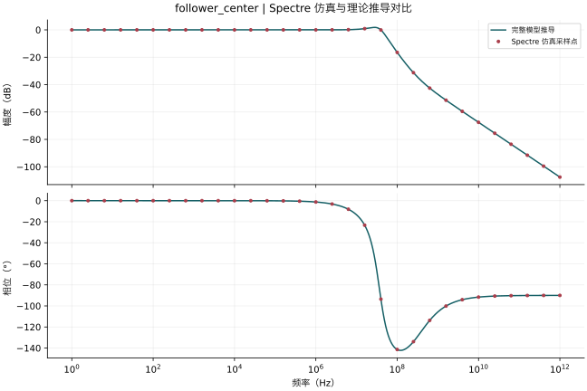

[波形 CSV](csv/follower_center.csv) · [运行网表](netlists/linear_suite.scs)

#### follower_center_z · 显式小信号组件

由 Spectre 输出的复数波形，逐频点与完整式比较；相位与正负号均纳入。
最大相对误差：**4.17e-06**；保存点数：721。

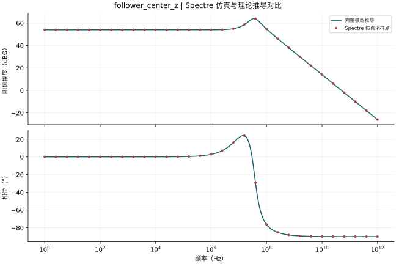

[波形 CSV](csv/follower_center_z.csv) · [运行网表](netlists/linear_suite.scs)

#### mos_follower · MOS1 教学晶体管

由 Spectre 输出的复数波形，逐频点与完整式比较；相位与正负号均纳入。
最大相对误差：**3.76e-06**；保存点数：601。

DC 输出：1 V；所有器件通过饱和区检查。完整式使用实际工作点的 gm、gds 与 Cgs。

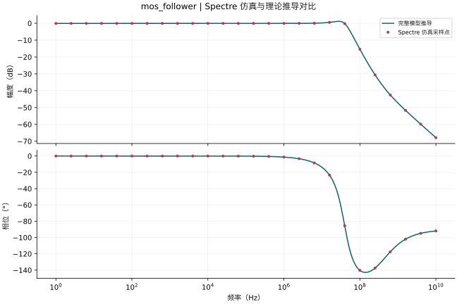

[波形 CSV](csv/mos_follower.csv) · [运行网表](netlists/mos_validation.scs)

本组另有直接 PZ 结果：follower_cancel、follower_center。详见上方极零图与 JSON。

### 10 · 射极跟随器：有限 β 与高频阻抗

本推导组的代表模型已完成 Spectre 验证；覆盖范围以所列网表为准，未逐一搭建所有幻灯片电路。

[完整公式推导](../../derivations/ch02/10-emitter-hf.html)

#### bjt_follower_z · 显式小信号组件

由 Spectre 输出的复数波形，逐频点与完整式比较；相位与正负号均纳入。
最大相对误差：**4.03e-06**；保存点数：721。

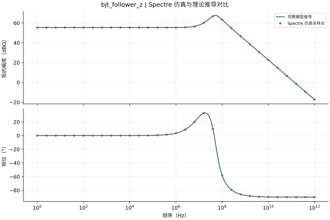

[波形 CSV](csv/bjt_follower_z.csv) · [运行网表](netlists/linear_suite.scs)

### 11 · 有源电感与差分调谐负载

本推导组的代表模型已完成 Spectre 验证；覆盖范围以所列网表为准，未逐一搭建所有幻灯片电路。

[完整公式推导](../../derivations/ch02/11-active-inductors.html)

#### active_inductor · 显式小信号组件

由 Spectre 输出的复数波形，逐频点与完整式比较；相位与正负号均纳入。
最大相对误差：**3.83e-06**；保存点数：721。

教材近似式另行比较：在 1 Hz–1 MHz，最大相对偏差为 **0.314%**。此数字与完整式验证分开；橙色虚线显示近似式。

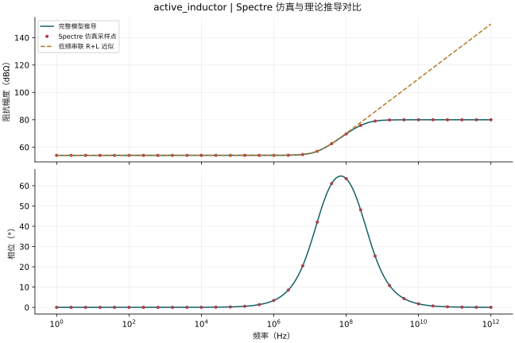

[波形 CSV](csv/active_inductor.csv) · [运行网表](netlists/linear_suite.scs)

### 12 · 共栅级的输入、输出与跨阻

本推导组的代表模型已完成 Spectre 验证；覆盖范围以所列网表为准，未逐一搭建所有幻灯片电路。

[完整公式推导](../../derivations/ch02/12-common-gate.html)

#### common_gate · 显式小信号组件

由 Spectre 输出的复数波形，逐频点与完整式比较；相位与正负号均纳入。
最大相对误差：**4.46e-07**；保存点数：721。

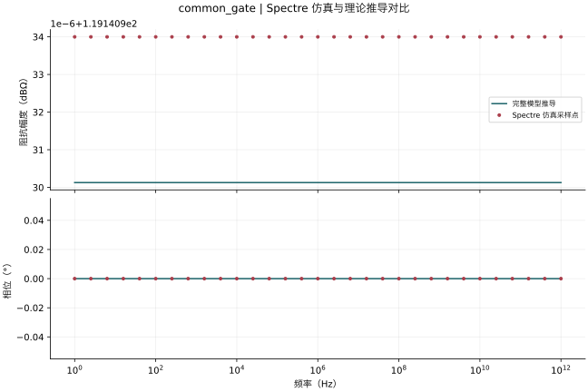

[波形 CSV](csv/common_gate.csv) · [运行网表](netlists/linear_suite.scs)

### 13 · 共源共栅级：有限输出电阻的完整式

本推导组的代表模型已完成 Spectre 验证；覆盖范围以所列网表为准，未逐一搭建所有幻灯片电路。

[完整公式推导](../../derivations/ch02/13-cascode.html)

#### cascode · 显式小信号组件

由 Spectre 输出的复数波形，逐频点与完整式比较；相位与正负号均纳入。
最大相对误差：**4.9e-06**；保存点数：721。

教材近似式另行比较：在 1 Hz–1 MHz，最大相对偏差为 **0.991%**。此数字与完整式验证分开；橙色虚线显示近似式。

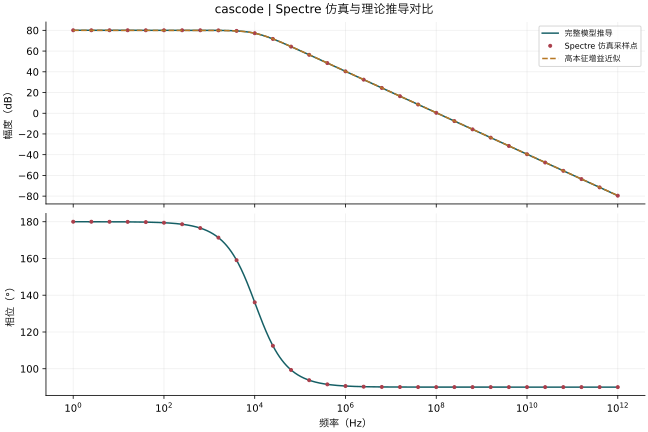

[波形 CSV](csv/cascode.csv) · [运行网表](netlists/linear_suite.scs)

#### mos_cascode · MOS1 教学晶体管

由 Spectre 输出的复数波形，逐频点与完整式比较；相位与正负号均纳入。
最大相对误差：**4.37e-06**；保存点数：601。

DC 输出：2 V；所有器件通过饱和区检查。完整式使用实际工作点的 gm、gds 与 Cgs。

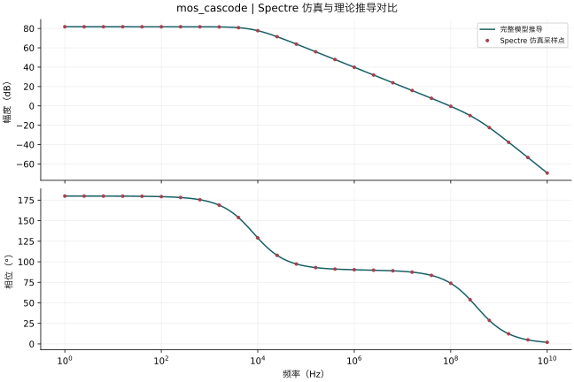

[波形 CSV](csv/mos_cascode.csv) · [运行网表](netlists/mos_validation.scs)

### 14 · 共源共栅级的米勒电容

本推导组的代表模型已完成 Spectre 验证；覆盖范围以所列网表为准，未逐一搭建所有幻灯片电路。

[完整公式推导](../../derivations/ch02/14-cascode-miller.html)

#### cascode_miller · 显式小信号组件

由 Spectre 输出的复数波形，逐频点与完整式比较；相位与正负号均纳入。
最大相对误差：**4.95e-06**；保存点数：721。

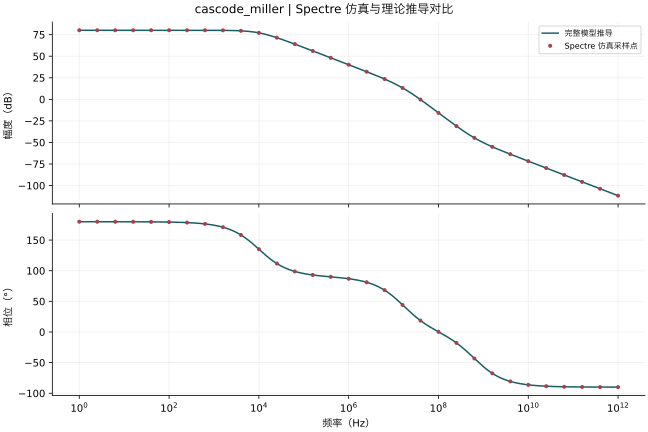

[波形 CSV](csv/cascode_miller.csv) · [运行网表](netlists/linear_suite.scs)

### 15 · 共源共栅级中间节点电容

本推导组的代表模型已完成 Spectre 验证；覆盖范围以所列网表为准，未逐一搭建所有幻灯片电路。

[完整公式推导](../../derivations/ch02/15-cascode-middle-cap.html)

#### cascode_cm_small · 显式小信号组件

由 Spectre 输出的复数波形，逐频点与完整式比较；相位与正负号均纳入。
最大相对误差：**4.89e-06**；保存点数：721。

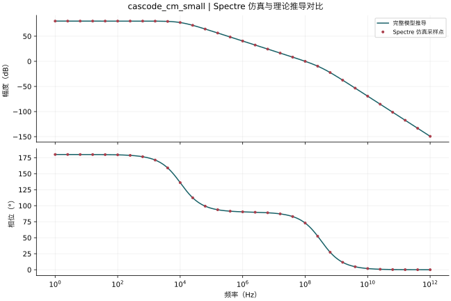

[波形 CSV](csv/cascode_cm_small.csv) · [运行网表](netlists/linear_suite.scs)

#### cascode_cm_large · 显式小信号组件

由 Spectre 输出的复数波形，逐频点与完整式比较；相位与正负号均纳入。
最大相对误差：**4.95e-06**；保存点数：721。

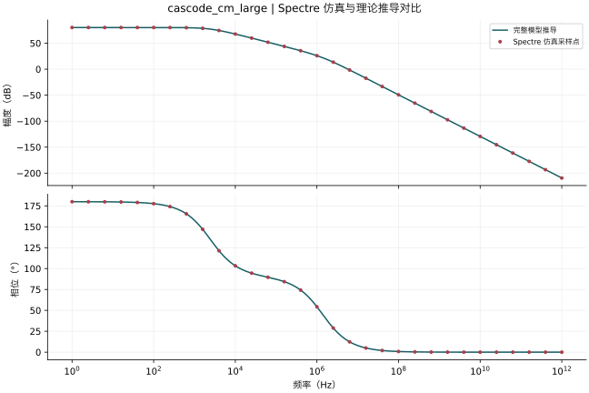

[波形 CSV](csv/cascode_cm_large.csv) · [运行网表](netlists/linear_suite.scs)

### 16 · 套筒式与折叠式共源共栅级

本推导组的代表模型已完成 Spectre 验证；覆盖范围以所列网表为准，未逐一搭建所有幻灯片电路。

[完整公式推导](../../derivations/ch02/16-telescopic-folded.html)

#### telescopic · 显式小信号组件

由 Spectre 输出的复数波形，逐频点与完整式比较；相位与正负号均纳入。
最大相对误差：**4.9e-06**；保存点数：721。

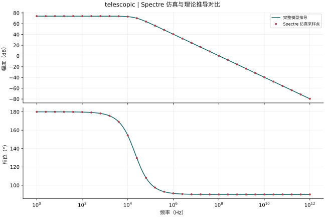

[波形 CSV](csv/telescopic.csv) · [运行网表](netlists/linear_suite.scs)

#### folded · 显式小信号组件

由 Spectre 输出的复数波形，逐频点与完整式比较；相位与正负号均纳入。
最大相对误差：**4.37e-06**；保存点数：721。

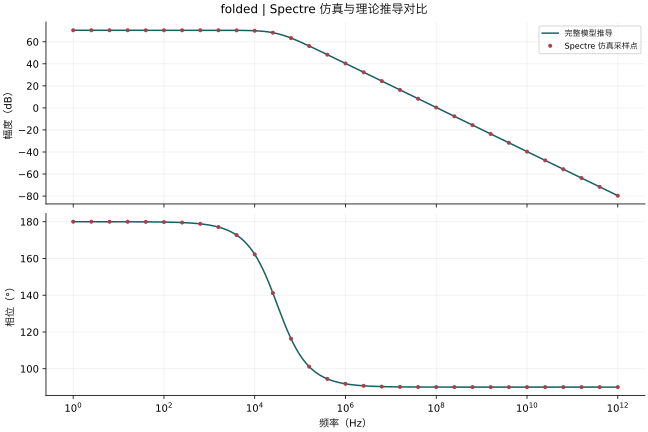

[波形 CSV](csv/folded.csv) · [运行网表](netlists/linear_suite.scs)

### 17 · 级联与米勒补偿

本推导组的代表模型已完成 Spectre 验证；覆盖范围以所列网表为准，未逐一搭建所有幻灯片电路。

[完整公式推导](../../derivations/ch02/17-cascade.html)

#### two_stage · 显式小信号组件

由 Spectre 输出的复数波形，逐频点与完整式比较；相位与正负号均纳入。
最大相对误差：**4.4e-06**；保存点数：721。

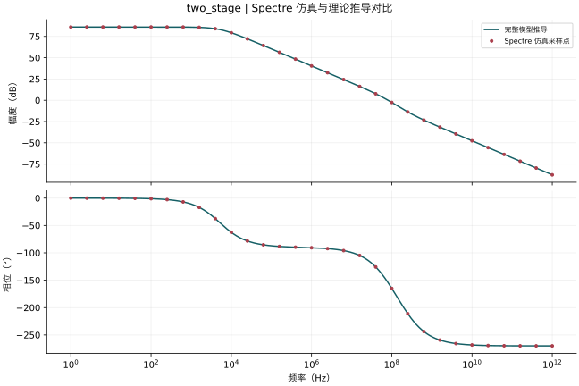

[波形 CSV](csv/two_stage.csv) · [运行网表](netlists/linear_suite.scs)

本组另有直接 PZ 结果：two_stage。详见上方极零图与 JSON。

### 18 · 调节型共源共栅级与增益增强

本推导组的代表模型已完成 Spectre 验证；覆盖范围以所列网表为准，未逐一搭建所有幻灯片电路。

[完整公式推导](../../derivations/ch02/18-gain-boosting.html)

#### gainboost_slow · 显式小信号组件

由 Spectre 输出的复数波形，逐频点与完整式比较；相位与正负号均纳入。
最大相对误差：**4.89e-06**；保存点数：721。

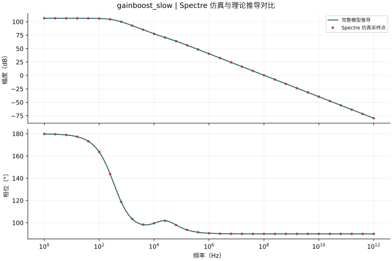

[波形 CSV](csv/gainboost_slow.csv) · [运行网表](netlists/linear_suite.scs)

#### gainboost_fast · 显式小信号组件

由 Spectre 输出的复数波形，逐频点与完整式比较；相位与正负号均纳入。
最大相对误差：**4.86e-06**；保存点数：721。

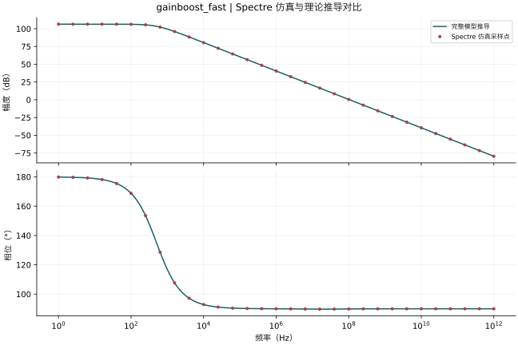

[波形 CSV](csv/gainboost_fast.csv) · [运行网表](netlists/linear_suite.scs)

本组另有直接 PZ 结果：gainboost_slow。详见上方极零图与 JSON。

### 19 · 极零对与高精度建立过程

本推导组的代表模型已完成 Spectre 验证；覆盖范围以所列网表为准，未逐一搭建所有幻灯片电路。

[完整公式推导](../../derivations/ch02/19-doublet-settling.html)

本组的三个瞬态情境及波形见上方极零对小节。

### 20 · MOS／BJT 端口量总结

本推导组的代表模型已完成 Spectre 验证；覆盖范围以所列网表为准，未逐一搭建所有幻灯片电路。

[完整公式推导](../../derivations/ch02/20-port-summary.html)

#### bjt_degen_gain · 显式小信号组件

由 Spectre 输出的复数波形，逐频点与完整式比较；相位与正负号均纳入。
最大相对误差：**5.77e-07**；保存点数：721。

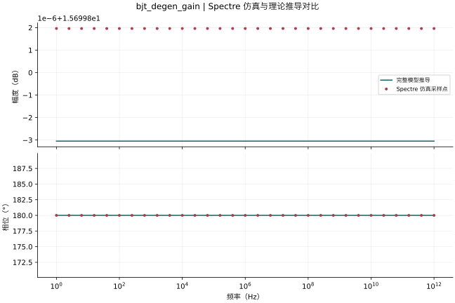

[波形 CSV](csv/bjt_degen_gain.csv) · [运行网表](netlists/linear_suite.scs)

#### bjt_degen_zout · 显式小信号组件

由 Spectre 输出的复数波形，逐频点与完整式比较；相位与正负号均纳入。
最大相对误差：**3.26e-07**；保存点数：721。

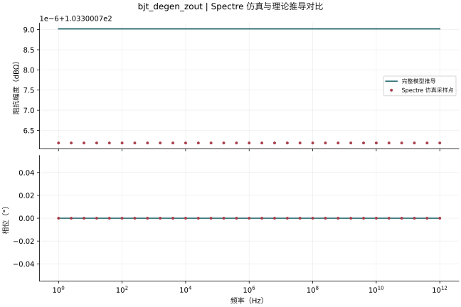

[波形 CSV](csv/bjt_degen_zout.csv) · [运行网表](netlists/linear_suite.scs)

## 尚待延伸的验证

- 以实际 PDK 替换 MOS1，重新产生 gm/Id、电容和增益查表。
- 本轮针对各推导组的代表模型；例如 0216 的线性区可调 M2、0246–0247 的完整有源电感实现，仍需各自的器件级偏置与稳定性案例。
- BJT 目前使用显式 混合 π 型 等效元件；未使用工艺 BJT 模型扫描偏置。
- 0244 的教材原模型／符号仍待厘清；仿真验证了本项目明列的等效模型，不能反向证明该教材原式。

## 重现与原始数据

所有正式网表、CSV、图及原始 PSF 都保存在本地工作区。远程 `/tmp` 只用作运行暂存；不依赖其长期存在。运行命令、exit code 与网表 SHA-256 保存在各 run 的 `result.json`。

[使用与重建说明](README.md) · [运行记录索引](verification.json)
